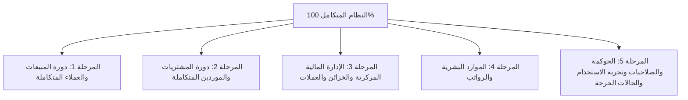

# 🏛️ الخطة الشاملة لاختبار وضمان جودة نظام MWHEBA ERP
## (Master Functional QA & Business Testing Blueprint)

---

## 🎯 الغرض ونطاق العمل (Objective & Scope)
هذا المستند يمثل **خارطة الطريق المرجعية الشاملة (Master Roadmap)** لفحص واختبار نظام **MWHEBA ERP** بنسبة **100%** من منظور المستخدم والمحاسب وإدارة الأعمال (**Black-Box / Functional QA Testing**).

الهدف الأساسي هو التأكد من:
1. **الصحة المحاسبية والمالية بنسبة 100%:** تطابق القيود، الأرصدة، كشوف الحسابات، وتسويات العملات المتعددة بدون أي فروق غير مبررة.
2. **تكامل دورات العمل (End-to-End Integrity):** سريان البيانات بسلاسة من نقطة البداية (عرض سعر / أمر شراء) إلى نقطة النهاية (المخزن / الخزينة / القوائم الختامية).
3. **متانة النظام وتجربة المستخدم (Robustness & UX):** كشف أي أخطاء في الواجهات، الفلاتر، التصفح عبر الموبايل (خصوصاً iOS Safari)، ومنع إدخال بيانات خاطئة أو غير منطقية.

---

## 🧭 منهجية وقواعد الاختبار (Testing Methodology & Rules)

1. **الاختبار الوظيفي المباشر (No Code Inspection):** الاختبار يتم كاملاً عبر واجهة المستخدم (UI)، النماذج، الجداول، والأزرار المتاحة للمستخدم النهائي.
2. **المنظور المزدوج (Dual Perspective):**
   - **منظور المستخدم الطبيعي:** إدخال البيانات ومتابعة العمليات بالطريقة المعتادة والتأكد من وضوح وسرعة النظام.
   - **منظور المستخدم العشوائي / المشاغب (Destructive Testing):** محاولة كسر السيستم عبر إدخال قيم غير منطقية، ترك حقول فارغة، الضغط المتكرر، أو تجاوز الأرصدة المتاحة.
3. **التوثيق الدقيق والفوري:** أي خطأ أو ملاحظة تُسجل فوراً في جدول الأخطاء المرفق مع الخطوات المحددة لإعادة إنتاجه.

---

## 🗺️ الهيكل العام للمراحل التشغيلية الخمس (The 5 Testing Phases)

---

## 📑 تفاصيل ومحاور المراحل التشغيلية

---

### 1️⃣ المرحلة الأولى: دورة المبيعات والعملاء المتكاملة (Integrated Sales Cycle)
> **النطاق:** العملاء + تسعير الأصناف + عروض الأسعار + فواتير المبيعات + المخزون الصادر + سندات القبض وتوزيع الدفعات + المرتجعات + كشف الحساب.

#### 📌 المحاور الرئيسية للاختبار:
1. **عروض الأسعار (Quotations):**
   - إنشاء عروض أسعار بتفاصيل الأصناف، الكميات، الخصومات، والضرائب.
   - تعديل العروض، طباعتها، وتجربة تحويلها المباشر إلى فاتورة مبيعات والتأكد من عدم سقوط أي بند.
2. **فواتير المبيعات (Sales Invoices):**
   - إصدار فواتير نقدية (Cash) وآجلة (Credit).
   - إصدار فواتير بعملات محلية وأجنبية (مثل الدولار) والتأكد من تطبيق سعر الصرف اليومي بدقة.
   - تطبيق الخصومات (نسبة / مبلغ) والضرائب ومطابقة الإجماليات الحسابية.
   - التأكد من الخصم المباشر للكميات المباعة من رصيد المخزن فور اعتماد الفاتورة.
   - فحص منع البيع بالسالب أو ظهور التحذير المناسب عند تجاوز الكميات المتوفرة.
3. **سندات القبض والتحصيل (Payment Receipts & Allocation):**
   - تسجيل سندات قبض نقدية وشيكات وتحويلات بنكية.
   - سداد كامل للفاتورة، أو سداد جزئي (دفعات متفرقة).
   - توزيع دفعة مجمعة على أكثر من فاتورة لنفس العميل.
   - التأكد من دخول الأموال في الخزينة/البنك المحدد وتحديث حالة الفاتورة (مدفوعة / مدفوعة جزئياً).
4. **مرتجعات المبيعات والإشعارات (Sales Returns & Credit Notes):**
   - عمل مرتجع جزئي أو كلي لفاتورة مباعة.
   - التأكد من رد البضاعة المرتجعة إلى المخزن ببياناتها الدقيقة.
   - معالجة القيمة المالية للمرتجع (تخفيض مديونية العميل أو رد كاش من الخزينة).
5. **كشف حساب العميل والتقارير (Customer Statements):**
   - مطابقة حركات كشف الحساب (رصيد افتتاحي ⬅️ فواتير ⬅️ سدادات ⬅️ مرتجعات = الرصيد النهائي).
   - تجربة فلاتر الفترة الزمنية وتصدير كشف الحساب PDF و Excel والطباعة.

---

### 2️⃣ المرحلة الثانية: دورة المشتريات والموردين المتكاملة (Integrated Purchase Cycle)
> **النطاق:** الموردين + تكلفة الأصناف + فواتير الشراء + المخزون الوارد + سندات الصرف وسداد الموردين + المرتجعات + كشف الحساب.

#### 📌 المحاور الرئيسية للاختبار:
1. **فواتير المشتريات (Purchase Invoices):**
   - تسجيل فواتير شراء نقدية وآجلة بعملات مختلفة (محلي / أجنبي).
   - إضافة تكاليف شحن أو مصاريف إضافية إن وجدت وتأثيرها على تكلفة الوحدة.
   - التحقق من إضافة البضاعة فوراً إلى رصيد المخزن وتحديث متوسط تكلفة الصنف.
   - التأكد من إثبات مديونية المورد بدقة في حسابه.
2. **سندات الصرف وسداد الموردين (Payment Vouchers):**
   - سداد كامل أو جزئي لفواتير الموردين من الخزائن أو الحسابات البنكية.
   - التأكد من انخفاض رصيد الخزينة/البنك فور السداد، وانخفاض رصيد المورد بنفس القيمة.
3. **مرتجعات المشتريات (Purchase Returns):**
   - إنشاء مرتجع بضاعة لمورد والتأكد من خصم الكميات من المخزن.
   - تعديل رصيد المورد بالخصم أو استرداد نقدية في الخزينة.
4. **كشف حساب المورد ومطابقة الأرصدة (Supplier Statements):**
   - فحص الحركات التراكمية، ومطابقة الفواتير مع السدادات، والتحقق من صحة الرصيد الختامي للمورد.

---

### 3️⃣ المرحلة الثالثة: الإدارة المالية المركزية والخزائن والعملات (Financials & Treasury)
> **النطاق:** دليل الحسابات + الخزن والبنوك + التحويلات النقدية والعملات + المصروفات والإيرادات + تقييم العملات IAS 21 + إقفال الفترات + التقارير الختامية.

#### 📌 المحاور الرئيسية للاختبار:
1. **الخزن والبنوك وسندات القبض/الصرف العامة:**
   - تسجيل مصروفات تشغيلية (إيجار، كهرباء، صيانة، بوفيه، إكراميات).
   - تسجيل إيرادات متنوعة غير مرتبطة بفواتير مبيعات.
   - فحص كشف حركة الخزينة والتأكد من مطابقة الرصيد الدفتري مع النقدية الفعلية.
2. **التحويلات النقدية وتحويلات العملات (Cash Transfers):**
   - تحويل أموال بين خزينتين بنفس العملة (جنيه إلى جنيه).
   - تحويل بين عملات مختلفة (مثال: سحب 100$ وإيداع ما يعادلها بالجنيه) والتأكد من حساب وتوجيه أرباح/خسائر فروق الصرف المحققة تلقائياً.
3. **إعادة تقييم العملات الأجنبية (IAS 21 FX Revaluation):**
   - تشغيل تقييم أرصدة العملات الأجنبية في نهاية الشهر/الفترة والتأكد من قيود الأرباح والخسائر غير المحققة.
4. **إقفال الفترات المالية وتجربة إعادة الفتح (Period Closing & Re-opening):**
   - إقفال فترة مالية والتأكد من منع إضافة أو تعديل أو حذف أي حركة مالية بتاريخ يقع داخل الفترة المغلقة.
   - تجربة إعادة فتح الفترة وفحص قيود العكس ومسار التدقيق (Audit Trail).
5. **التقارير المالية الختامية (Financial Statements):**
   - ميزان المراجعة (Trial Balance) والتأكد من توازن المدين والدائن.
   - قائمة الدخل (الأرباح والخسائر - Income Statement).
   - الميزانية العمومية (Balance Sheet) وتطابق الأصول مع الالتزامات وحقوق الملكية.

---

### 4️⃣ المرحلة الرابعة: الموارد البشرية والرواتب (HR & Payroll)
> **النطاق:** ملفات الموظفين + الحضور والانصراف + السلف والخصومات + مسيرات الرواتب وصرفها محاسبياً.

#### 📌 المحاور الرئيسية للاختبار:
1. **ملفات الموظفين والبدلات:**
   - إضافة موظف براتبه الأساسي، البدلات الثابتة، وبياناته الوظيفية.
2. **الحضور والانصراف والإجازات:**
   - تسجيل أيام العمل، التأخيرات، الغياب، والإجازات الاعتيادية والمرضية والبدون راتب.
3. **السلف والخصومات والمكافآت:**
   - طلب سلفة لموظف، اعتمادها، وصرفها نقدياً من الخزينة.
   - تسجيل مكافآت تشجيعية أو جزاءات وخصومات.
4. **إعداد وصرف مسير الرواتب (Monthly Payroll):**
   - توليد مسير الرواتب الشهري وحساب صافي الراتب بدقة (الأساسي + البدلات + المكافآت - السلف - الغياب والخصومات).
   - اعتماد المسير وإصدار القيد المحاسبي للرواتب تلقائياً.
   - صرف الرواتب من الخزينة/البنك والتأكد من تصفير مستحقات الشهر.

---

### 5️⃣ المرحلة الخامسة: الحوكمة والصلاحيات وتجربة الاستخدام والحالات الحرجة (Governance & Edge Cases)
> **النطاق:** المستخدمين والأدوار + مسارات الاعتماد + سجل العمليات + تجربة الموبايل (Safari / Chrome) + محاولات كسر السيستم.

#### 📌 المحاور الرئيسية للاختبار:
1. **الصلاحيات وتعدد الأدوار (Users, Roles & Permissions):**
   - إنشاء مستخدم بدور "كاشير / بائع" والتأكد من عدم قدرته على رؤية أرباح الفواتير، التقارير الختامية، أو تعديل قيود المحاسبة.
   - إنشاء مستخدم بدور "محاسب" ومستخدم "مدير نظام" والتأكد من حدود صلاحية كل مستخدم.
2. **مسارات الاعتماد والموافقات (Approval Workflows):**
   - تجربة المستندات التي تتطلب موافقة مدير (مثل إلغاء فاتورة، تجاوز حد ائتمان، أو خصم كبير) والتأكد من توقف العملية حتى الاعتماد.
3. **سجل العمليات والتتبع (Audit Log):**
   - تتبع سجل العمليات لمعرفة: من أنشأ المستند، من عدله، وما البيانات السابقة والجديدة.
4. **استجابة الواجهة وتجربة الموبايل (Mobile & Responsive UX):**
   - تسجيل عمليات وفواتير كاملة من متصفحات الموبايل (iOS Safari و Android Chrome).
   - فحص عمل النوافذ المنبثقة (Modals)، القوائم المنسدلة (Select2)، واختيار التواريخ بدون تعليق.
5. **محاولات كسر السيستم والحالات الشاذة (Edge Cases & Stress Testing):**
   - إدخال قيم سالبة، أو نصوص داخل حقول الأرقام.
   - محاولة حفظ نماذج بحقول إلزامية فارغة والتأكد من وضوح رسائل التنبيه للمستخدم.
   - الضغط المتكرر السريع على أزرار الحفظ لمنع تكرار إنشاء المستندات (Double Submissions).

---

## 📝 نموذج تسجيل الأخطاء والملاحظات (Standard Bug Logging Template)

يتم تسجيل كل مشكلة أو ملاحظة في ملف أو شيت الاختبار بالهيكل التالي:

| الحقل | الوصف المطلوب | مثال توضيحي |
|---|---|---|
| **رقم الخطأ (Bug ID)** | ترقيم تسلسلي | BUG-001 |
| **المرحلة والموديول** | اسم المرحلة والشاشة | المرحلة 1: فواتير المبيعات |
| **درجة الخطورة (Severity)** | (حرج Critical / عالي High / متوسط Medium / بسيط Low) | حرج Critical (مشكلة في الحسابات) |
| **عنوان المشكلة** | وصف مختصر ومباشر | الخصم بالنسبة المئوية لا يتم خصمه من إجمالي الفاتورة بالدولار |
| **خطوات إعادة الخطأ (Steps)** | الخطوات بالتفصيل لكي يكررها المطور | 1. فتح شاشة فاتورة مبيعات جديدة. 2. اختيار عميل بعملة USD. 3. إضافة صنف بسعر 100$. 4. كتابة خصم 10%. |
| **النتيجة الفعلية (Actual)** | ما حدث بالفعل على الشاشة | يظل الإجمالي 100$ ولا يتم تطبيق الخصم. |
| **النتيجة المتوقعة (Expected)** | ما كان يجب أن يحدث بشكل صحيح | يجب أن يصبح الإجمالي بعد الخصم 90$. |
| **المرفقات (Attachments)** | صورة شاشة أو فيديو توضيحي | [رابط الصورة / Screenshot] |

---

## 🏁 آلية الاعتماد والتنفيذ خطوة بخطوة

1. يبدأ الـ Tester بالعمل على **المرحلة الأولى** وتسجيل كافة ملاحظاته.
2. يتم تسليم تقرير المرحلة الأولى ومراجعة وإصلاح أي أخطاء تظهر بها.
3. الانتقال للمرحلة التالية بنفس الترتيب حتى استكمال المراحل الخمس.
4. عند الانتهاء، يتم عمل جولة مراجعة نهائية (Regression Test) للتأكد من استقرار النظام بنسبة **100%**.
