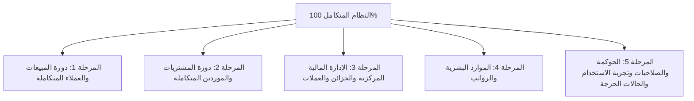

# 🏛️ الخطة الشاملة لاختبار وضمان جودة نظام MWHEBA ERP
## (Master Functional QA & Business Testing Blueprint)
### Document ID: `QA-MASTER-ROADMAP-V1.0`

---

## 🎯 الغرض ونطاق العمل (Objective & Scope)
هذا المستند يمثل **خارطة الطريق المرجعية الشاملة (Master Roadmap)** لفحص واختبار نظام **MWHEBA ERP** بنسبة **100%** من منظور المستخدم والمحاسب وإدارة الأعمال (**Black-Box Functional QA Testing**).

الهدف الأساسي هو التأكد من:
1. **الصحة المحاسبية والمالية بنسبة 100%:** تطابق القيود، الأرصدة، كشوف الحسابات، وتسويات العملات المتعددة بدون أي فروق غير مبررة.
2. **تكامل دورات العمل (End-to-End Integrity):** سريان البيانات بسلاسة من نقطة البداية (عرض سعر / أمر شراء / إذن تسليم) إلى نقطة النهاية (المخزن / الخزينة / القوائم الختامية).
3. **متانة النظام وتجربة المستخدم (Robustness & UX):** كشف أي أخطاء في الواجهات، الفلاتر، التصفح عبر الموبايل (خصوصاً iOS Safari)، ومنع إدخال بيانات خاطئة أو غير منطقية.

---

## 🧭 منهجية وقواعد الاختبار الموحدة (Standard Testing Rules)

1. **تسلسل العمليات وتراكمية البيانات (Sequential Lifecycle):**
   - الاختبارات داخل كل مرحلة تسير بتسلسل تراكمي يحاكي دورة العمل الواقعية في الشركات (Master Data ⬅️ حركات ⬅️ سدادات ⬅️ مرتجعات ⬅️ كشوف حسابات وتقارير ختامية).
   - لا يتطلب الفحص تفريغ الداتابيز بعد كل اختبار؛ فالتراكم هو ما يكشف أخطاء الأرصدة وموازين المراجعة بدقة.
2. **قاعدة فحص القيد المحاسبي لأول نمط جديد فقط (First-Time Pattern Rule):**
   - عند تجربة نوع معاملة جديد لأول مرة (مثل أول فاتورة كاش، أول فاتورة آجل، أول فاتورة بالدولار، أول فاتورة بضريبة WHT، أول إذن تسليم COGS، أول سند صرف، وأول مرتجع)؛ يتم فحص القيد المحاسبي المتولد للتأكد من توجيه الحسابات وتوازن المدين والدائن.
   - في الحركات المتكررة المشابهة بعدها، يكتفي الـ Tester بفحص الواجهة، المخزن، وكشف الحساب ورصيد الخزينة لتسريع الفحص.
3. **هيكل حالات الاختبار الموحد (Unified Test Case Format):**
   - كل حالة اختبار تحمل كوداً فريداً (`TC-<MODULE>-XXX`)، هدفاً محدداً، خطوات تفصيلية بأرقام واقعية، ونتائج متوقعة محددة بصناديق اختيار `[ ]` تغطي كافة أبعاد النظام (الواجهة + المخزن + الحسابات).
4. **التوثيق الدقيق والفوري:** أي خطأ أو ملاحظة تُسجل فوراً في جدول الأخطاء المرفق بنهاية كل ملف.

---

## 🗺️ الهيكل العام للمراحل التشغيلية الخمس (The 5 Testing Phases)

---

## 📑 تفاصيل ومحاور المراحل التشغيلية الخمس

---

### 1️⃣ المرحلة الأولى: دورة المبيعات والعملاء المتكاملة (Integrated Sales & Customer Cycle)
> **الملف التشغيلي:** `docs/qa_test_plans/01_SALES_CYCLE_TEST_PLAN.md`  
> **النطاق:** العملاء + سياسات التسعير وقواعد الخصم + عروض الأسعار + أوامر البيع وحجز المخزون + إذون تسليم البضائع وتكلفة المبيعات + فواتير المبيعات الشاملة + سندات القبض وتوزيع الدفعات + المرتجعات ومذكرات الائتمان + كشوف الحسابات وأعمار الديون والتقارير + الحالات الحرجة.

#### 📌 المحاور الرئيسية للاختبار:
1. **بيانات العملاء وحد الائتمان (Client Master & Credit Control):**
   - حفظ بيانات العميل الضريبية والتجارية، وقوائم الأسعار الافتراضية.
   - الأرصدة الافتتاحية بالعملات المحلية والأجنبية وسعر الصرف.
   - حد الائتمان (Credit Limit) وفترات السداد وحماية حذف العملاء المرتبطين بحسابات.
2. **سياسات التسعير وقواعد الخصم الآلي (Pricing Policies & Discount Rules):**
   - إنشاء قوائم أسعار متعددة (جملة/قطاعي/موزعين).
   - قواعد الخصم التلقائي بناءً على الكمية أو قيمة الطلب.
   - سجل تدقيق التسعير (`PricingAuditLog`) لتتبع أي تلاعب يدوي بالأسعار.
3. **عروض الأسعار وأوامر البيع (Quotations & Sales Orders):**
   - إنشاء عروض الأسعار، الخصومات، والتحويل لأمر بيع أو فاتورة.
   - أوامر البيع وحجز المخزون (`Reserved`) وحساب الكميات المتاحة للبيع (`ATP`).
4. **إذون تسليم البضائع وتكلفة المبيعات (Delivery Notes & COGS):**
   - إثبات خروج البضاعة الفعلي وقيد تكلفة البضاعة المباعة (`COGS`).
   - التسليم الكامل والجزئي على دفعات متعددة.
5. **محرك فواتير المبيعات الشامل (Sales Invoices Engine):**
   - فواتير كاش، آجل، ودولار (سعر الصرف والمعادل المحلي).
   - خصم سطر + خصم إجمالي، وضريبة القيمة المضافة 14% (شامل وغير شامل).
   - ضريبة الخصم والإضافة **WHT** بنسبها **(1% توريدات / 3% خدمات / 5% مهن)**.
   - مصاريف الشحن والتسويات الإضافية وتعديل وإلغاء الفواتير.
6. **التحصيل وسندات القبض (Payment Receipts & Allocation):**
   - سداد كامل، جزئي، وسند قبض مجمع على عدة فواتير (FIFO وتوزيع يدوي).
   - الدفعات المقدمة، تحصيلات العملات الأجنبية، وإلغاء السندات.
7. **المرتجعات ومذكرات الائتمان (Returns & Credit Notes):**
   - المرتجع الجزئي المرتبط بفاتورة، منع تجاوز الكمية المباعة، ومذكرات الائتمان المستقلة.
8. **كشوف الحسابات وأعمار الديون والتقارير والطباعة:**
   - كشف الحساب التراكمي، تقرير أعمار الديون (AR Aging)، أرباح الفواتير، والطباعة الرسمية (A4، حراري، Excel/PDF).

---

### 2️⃣ المرحلة الثانية: دورة المشتريات والموردين المتكاملة (Integrated Purchase & Supplier Cycle)
> **الملف التشغيلي المستهدف:** `docs/qa_test_plans/02_PURCHASE_CYCLE_TEST_PLAN.md`  
> **النطاق:** الموردين + أوامر الشراء + إذون استلام البضائع والمطابقة الثلاثية + تكاليف الاستيراد الإضافية + فواتير المشتريات + سندات الصرف وسداد الموردين + مرتجعات المشتريات + كشوف حسابات الموردين وأعمار الديون.

#### 📌 المحاور الرئيسية للاختبار:
1. **بيانات الموردين والأرصدة الافتتاحية (Supplier Master Data):**
   - تسجيل بيانات الموردين، الأرقام الضريبية، السجلات التجارية، والعملات.
   - الأرصدة الافتتاحية للموردين (محلي وأجنبي) وشروط الدفع.
2. **أوامر الشراء واعتمادها (Purchase Orders):**
   - إنشاء أوامر الشراء بتفاصيل الكميات والأسعار المتفق عليها.
   - دورة اعتماد أوامر الشراء وحالات المتابعة حتى الاستلام.
3. **إذون استلام البضائع والمطابقة الثلاثية (GRN & 3-Way Matching):**
   - تسجيل إثبات الاستلام الفعلي في المستودع (`Goods Receipt Note - GRN`) قبل وصول الفاتورة.
   - المطابقة الثلاثية بين (أمر الشراء + إذن الاستلام + فاتورة المورد) والتنبيه عند وجود أي فروق.
   - إثبات الاستحقاقات المعلقة للبضاعة المستلمة التي لم تفوتر بعد (`GRNI Subledger`).
4. **تكاليف الاستيراد الإضافية وتوزيع المصاريف (Landed Costs):**
   - تحميل مصاريف الشحن، الجمارك، والتأمين على تكلفة المنتجات المستلمة تلقائياً وتحديث متوسط التكلفة المرجح.
5. **محرك فواتير المشتريات (Purchase Invoices Engine):**
   - فواتير شراء نقدية وآجلة، وبعملات أجنبية وسعر الصرف اليومي.
   - إثبات ضريبة القيمة المضافة المدخلات والخصومات المكتسبة.
   - إثبات وتوريد ضريبة الخصم والإضافة (WHT) المخصومة من مستحقات المورد.
6. **سندات الصرف وسداد الموردين (Payment Vouchers):**
   - سداد كامل أو جزئي لفواتير الموردين من الخزائن أو الحسابات البنكية.
   - سداد دفعات مقدمة للموردين والتسوية منها لاحقاً.
7. **مرتجعات المشتريات والإشعارات المدينة (Purchase Returns & Debit Notes):**
   - إرجاع بضاعة لمورد وخصمها من المخزن وتخفيض مديونيته أو استرداد نقدي.
8. **كشوف الحسابات وأعمار ديون الموردين (Supplier Aging & Statements):**
   - كشف حساب المورد التراكمي ومطابقة الفواتير مع السدادات.
   - تقرير أعمار ديون الموردين (AP Aging: 30 / 60 / 90 / 90+ يوم).

---

### 3️⃣ المرحلة الثالثة: الإدارة المالية المركزية والخزائن والعملات (General Financials & Treasury)
> **الملف التشغيلي المستهدف:** `docs/qa_test_plans/03_TREASURY_FINANCIALS_TEST_PLAN.md`  
> **النطاق:** دليل الحسابات ومراكز التكلفة + الخزن والبنوك + التحويلات النقدية والعملات + المصروفات والإيرادات العامة + إقرار الإيرادات المؤجلة + إعادة تقييم العملات IAS 21 + إقفال الفترات المالية + التقارير الختامية.

#### 📌 المحاور الرئيسية للاختبار:
1. **دليل الحسابات وشجرة مراكز التكلفة (Chart of Accounts & Cost Centers):**
   - إضافة وتعديل الحسابات ومراكز التكلفة وتحديد الأرصدة الافتتاحية.
   - حماية القيود المرحلة من التعديل المباشر وإلزامية قيود التسوية.
2. **الخزن والبنوك وسندات القبض/الصرف العامة (Cash & Bank Operations):**
   - تسجيل المصروفات التشغيلية المباشرة (إيجار، كهرباء، صيانة، بوفيه، إكراميات).
   - تسجيل الإيرادات المتنوعة غير المرتبطة بالنشاط التجاري.
   - كشف حركة الخزينة ومطابقة الرصيد الدفتري مع النقدية الفعلية.
3. **التحويلات النقدية وتحويلات العملات (CashTransferService):**
   - التحويل بين الخزن وحسابات البنوك بنفس العملة.
   - التحويل بين عملات مختلفة (مثال: تحويل دولار لجنيه) والتأكد من القيد الآلي لأرباح/خسائر الصرف المحققة.
4. **إقرار وتوزيع الإيرادات المؤجلة (Revenue Recognition):**
   - جداول توزيع الإيرادات المؤجلة على الفترات الزمنية وتوليد قيود الاستحقاق الدورية آلياً.
5. **إعادة تقييم العملات الأجنبية وفق IAS 21 (FX Revaluation Engine):**
   - تشغيل تقييم أرصدة البنود النقدية بالعملات الأجنبية في نهاية الفترة وتسجيل الأرباح والخسائر غير المحققة.
6. **إقفال الفترات المالية وتجربة إعادة الفتح (Period Closing & Reversal):**
   - إقفال فترة مالية والتأكد من منع تسجيل أو تعديل أي حركة بتاريخ داخل الفترة.
   - تجربة إعادة فتح الفترة وفحص قيد العكس (`FXReversalService`) ومسار التدقيق.
7. **التقارير المالية الختامية ومطابقة الحسابات:**
   - ميزان المراجعة (Trial Balance) وتوازن المدين والدائن.
   - قائمة الدخل (Income Statement) ومجمل وصافي الربح.
   - الميزانية العمومية (Balance Sheet) وتطابق الأصول والالتزامات.

---

### 4️⃣ المرحلة الرابعة: الموارد البشرية والرواتب (HR & Payroll)
> **الملف التشغيلي المستهدف:** `docs/qa_test_plans/04_HR_PAYROLL_TEST_PLAN.md`  
> **النطاق:** ملفات الموظفين + الحضور والانصراف + السلف والخصومات والمكافآت + مسيرات الرواتب وصرفها محاسبياً.

#### 📌 المحاور الرئيسية للاختبار:
1. **ملفات الموظفين والبيانات التعاقدية (Employee Master Data):**
   - إضافة موظف براتبه الأساسي، البدلات الثابتة، الوظيفة، وبيانات الحساب البنكي.
2. **الحضور والانصراف والإجازات (Attendance & Leaves):**
   - تسجيل الحضور، التأخيرات، الغياب، والإجازات المدفوعة وغير المدفوعة.
3. **السلف والخصومات والمكافآت (Advances & Deductions):**
   - طلب سلفة، اعتمادها، وصرفها نقدياً من الخزينة، وجدولة استقطاعها من الراتب.
   - تسجيل المكافآت والجزاءات الإدارية.
4. **مسيرات الرواتب الشهرية والترحيل المحاسبي (Payroll Engine):**
   - توليد مسير الرواتب الشهري وحساب صافي المستحق بدقة (الأساسي + البدلات + المكافآت - السلف - الغياب والخصومات).
   - اعتماد المسير وترحيل قيد استحقاق الرواتب تلقائياً للدفتر العام.
   - صرف الرواتب من الخزينة/البنك وتصفير مستحقات الشهر.

---

### 5️⃣ المرحلة الخامسة: الحوكمة والصلاحيات وتجربة الاستخدام والحالات الحرجة (Governance & Edge Cases)
> **الملف التشغيلي المستهدف:** `docs/qa_test_plans/05_GOVERNANCE_SECURITY_EDGE_CASES.md`  
> **النطاق:** الصلاحيات وتعدد الأدوار + مسارات الاعتماد + سجل العمليات والتدقيق + مطابقة الموبايل + الحالات الحرجة ومحاولات كسر السيستم.

#### 📌 المحاور الرئيسية للاختبار:
1. **مصفوفة الأدوار والصلاحيات (Permissions & Roles Matrix):**
   - إنشاء مستخدمين بأدوار مختلفة (بائع، أمين مخزن، محاسب، مدير مالي).
   - التحقق من حجب الشاشات المالية وتعديل الأسعار عن البائعين وأمناء المخازن.
2. **صندوق الموافقات الموحد (Approval Inbox):**
   - تجربة المعاملات التي تتطلب موافقة مدير (كسر حد الائتمان، خصم استثنائي، تعديل سعر الصرف).
   - فحص تحديث عداد الموافقات المعلقة في الهيدر (`pending_approvals_count`) واعتماد/رفض الطلبات.
3. **سجل التدقيق وتتبع العمليات (Audit Logs):**
   - تتبع سجل العمليات: من أنشأ المستند، من عدله، وما هي القيم السابقة والحالية.
4. **استجابة الواجهات وتجربة الموبايل (Mobile Safari & Chrome Testing):**
   - تجربة إنشاء فواتير وسندات بالكامل من متصفح الموبايل والتابلت.
   - فحص عمل النوافذ المنبثقة (Modals)، القوائم المنسدلة (Select2)، واختيار التواريخ بدون أي تعليق.
5. **الحالات الشاذة ومحاولات كسر السيستم (Stress & Destructive Testing):**
   - الحقول الإلزامية، الأرقام السالبة، القيم الصفرية، ومنع الضغط المزدوج على أزرار الحفظ (Double Submit Guard).

---

## 📝 نموذج تسجيل الأخطاء والملاحظات الموحد (Bug Log Template)

| الحقل | الوصف المطلوب | مثال توضيحي |
|---|---|---|
| **رقم الخطأ (Bug ID)** | ترقيم تسلسلي | BUG-001 |
| **المرحلة والموديول** | اسم المرحلة والشاشة | المرحلة 2: فواتير المشتريات |
| **درجة الخطورة (Severity)** | (حرج Critical / عالي High / متوسط Medium / بسيط Low) | عالي High (مشكلة في توجيه الضريبة) |
| **عنوان المشكلة** | وصف مختصر ومباشر | ضريبة الخصم والإضافة WHT في المشتريات لا تنزل في الطرف الدائن |
| **خطوات إعادة الخطأ (Steps)** | الخطوات بالتفصيل لكي يكررها المطور | 1. إنشاء فاتورة شراء جديدة. 2. تفعيل ضريبة WHT بنسبة 1%. 3. حفظ واعتماد الفاتورة. 4. فتح القيد المحاسبي. |
| **النتيجة الفعلية (Actual)** | ما حدث بالفعل على الشاشة/القيد | القيد لم يحتوي على حساب مصلحة الضرائب - WHT موردة. |
| **النتيجة المتوقعة (Expected)** | ما كان يجب أن يحدث بشكل صحيح | ظهور حساب مصلحة الضرائب WHT في الجانب الدائن بالقيمة المخصومة. |
| **المرفقات (Attachments)** | صورة شاشة أو فيديو توضيحي | [رابط الصورة / Screenshot] |
