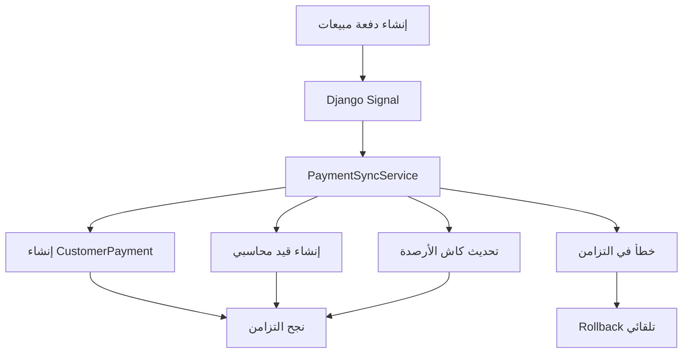

# 🏦 دليل النظام المالي الشامل - MWHEBA ERP

## 📋 جدول المحتويات

1. [نظرة عامة](#نظرة-عامة)
2. [هيكل النظام](#هيكل-النظام)
3. [النماذج المحاسبية](#النماذج-المحاسبية)
4. [الخدمات المالية](#الخدمات-المالية)
5. [نظام تزامن المدفوعات](#نظام-تزامن-المدفوعات)
6. [دليل المستخدم](#دليل-المستخدم)
7. [التقارير المالية](#التقارير-المالية)
8. [النسخ الاحتياطي](#النسخ-الاحتياطي)
9. [الأداء والتحسين](#الأداء-والتحسين)
10. [دليل التطوير](#دليل-التطوير)
11. [استكشاف الأخطاء](#استكشاف-الأخطاء)

---

## 🎯 نظرة عامة

النظام المالي المتقدم هو نظام محاسبي شامل مطور لنظام ERP باستخدام Django. يوفر النظام:

### ✨ الميزات الرئيسية
- **نظام قيود مزدوجة** متكامل ومتوازن تلقائياً
- **دليل حسابات هرمي** شامل ومرن
- **تزامن تلقائي للمدفوعات** مع نظام rollback
- **تقارير مالية متقدمة** مع تحسينات الأداء
- **نظام كاش متعدد المستويات** مع Redis
- **نسخ احتياطي ذكي** للبيانات المالية

### 🏗️ المعمارية
- **Django Framework** مع Python 3.8+
- **PostgreSQL** كقاعدة بيانات رئيسية
- **Redis** للكاش المتقدم
- **Celery** للمهام غير المتزامنة (اختياري)

---

## 🏗️ هيكل النظام

```
financial/
├── models/                     # النماذج المحاسبية
│   ├── chart_of_accounts.py   # دليل الحسابات
│   ├── journal_entry.py       # القيود المحاسبية
│   ├── enhanced_balance.py    # نظام الأرصدة المحسن
│   └── payment_sync.py        # تزامن المدفوعات
├── services/                   # الخدمات المالية
│   ├── journal_service.py     # خدمة القيود
│   ├── enhanced_balance_service.py
│   ├── payment_sync_service.py
│   ├── advanced_reports_service.py
│   ├── financial_backup_service.py
│   └── redis_cache_service.py
├── signals/                    # Django Signals
│   └── payment_signals.py
├── tests/                      # الاختبارات
│   ├── test_enhanced_balance_system.py
│   ├── test_payment_sync_system.py
│   └── test_performance_stress.py
├── migrations/                 # ميجريشن قاعدة البيانات
├── fixtures/                   # البيانات الأولية
└── admin_payment_sync.py      # واجهة الإدارة
```

---

## 📊 النماذج المحاسبية

### 1. AccountType - أنواع الحسابات

```python
class AccountType(models.Model):
    code = models.CharField(max_length=10, unique=True)
    name = models.CharField(max_length=100)
    category = models.CharField(max_length=20, choices=CATEGORY_CHOICES)
    nature = models.CharField(max_length=10, choices=NATURE_CHOICES)
```

**التصنيفات المدعومة:**
- `asset` - الأصول
- `liability` - الخصوم  
- `equity` - حقوق الملكية
- `revenue` - الإيرادات
- `expense` - المصروفات

### 2. ChartOfAccounts - دليل الحسابات

```python
class ChartOfAccounts(models.Model):
    code = models.CharField(max_length=20, unique=True)
    name = models.CharField(max_length=200)
    parent = models.ForeignKey('self', null=True, blank=True)
    account_type = models.ForeignKey(AccountType)
    is_leaf = models.BooleanField(default=True)
    is_active = models.BooleanField(default=True)
```

**الهيكل الهرمي:**
```
1000 - الأصول
├── 1001 - الأصول المتداولة
│   ├── 1001001 - الخزينة
│   └── 1001002 - البنك الأهلي
└── 1002 - الأصول الثابتة
    └── 1002001 - المعدات
```

### 3. JournalEntry - القيود المحاسبية

```python
class JournalEntry(models.Model):
    number = models.CharField(max_length=50, unique=True)
    date = models.DateField()
    description = models.TextField()
    status = models.CharField(max_length=20, choices=STATUS_CHOICES)
    accounting_period = models.ForeignKey(AccountingPeriod)
```

**حالات القيد:**
- `draft` - مسودة
- `posted` - مرحل
- `cancelled` - ملغي

### 4. JournalEntryLine - بنود القيود

```python
class JournalEntryLine(models.Model):
    journal_entry = models.ForeignKey(JournalEntry, related_name='lines')
    account = models.ForeignKey(ChartOfAccounts)
    debit = models.DecimalField(max_digits=15, decimal_places=2, default=0)
    credit = models.DecimalField(max_digits=15, decimal_places=2, default=0)
```

---

## ⚙️ الخدمات المالية

### 1. JournalEntryService - خدمة القيود

```python
# إنشاء قيد بسيط
entry = JournalEntryService.create_simple_entry(
    debit_account='1001',      # الخزينة
    credit_account='4001',     # إيرادات المبيعات
    amount=Decimal('1000'),
    description='بيع نقدي',
    date=date.today(),
    user=request.user
)

# إنشاء قيد مركب
entry = JournalEntryService.create_compound_entry(
    lines=[
        {'account': '1001', 'debit': 800, 'credit': 0},
        {'account': '1201', 'debit': 200, 'credit': 0},
        {'account': '4001', 'debit': 0, 'credit': 1000}
    ],
    description='بيع بالآجل',
    date=date.today(),
    user=request.user
)
```

### 2. EnhancedBalanceService - خدمة الأرصدة المحسنة

```python
# حساب رصيد حساب
balance = EnhancedBalanceService.get_account_balance_optimized(
    account='1001',
    date_to=date.today(),
    use_cache=True
)

# ميزان مراجعة محسن
trial_balance = EnhancedBalanceService.get_trial_balance_optimized(
    date_from=date(2025, 1, 1),
    date_to=date.today()
)

# إنشاء لقطة رصيد
EnhancedBalanceService.create_balance_snapshot(
    account=account_obj,
    snapshot_date=date.today()
)
```

### 3. PaymentSyncService - خدمة تزامن المدفوعات

```python
# تزامن دفعة
sync_operation = payment_sync_service.sync_payment(
    payment_obj=sale_payment,
    operation_type='create_payment',
    user=request.user
)

# التحقق من حالة التزامن
if sync_operation.status == 'completed':
    print("تم التزامن بنجاح")
elif sync_operation.status == 'failed':
    print(f"فشل التزامن: {sync_operation.error_message}")
```

---

## 🔄 نظام تزامن المدفوعات

### المشكلة المحلولة
- **قبل**: دفعات المبيعات تُسجل في `SalePayment` فقط
- **بعد**: تزامن تلقائي مع `CustomerPayment` + قيود محاسبية

### آلية العمل



### قواعد التزامن

```json
{
  "name": "تزامن دفعات المبيعات",
  "source_model": "sale_payment",
  "trigger_event": "on_create",
  "sync_to_customer_payment": true,
  "sync_to_journal_entry": true,
  "sync_to_balance_cache": true
}
```

### Django Signals المحسنة

```python
@receiver(post_save, sender=SalePayment)
def sale_payment_saved(sender, instance, created, **kwargs):
    if created:
        # تأجيل التزامن حتى انتهاء المعاملة
        transaction.on_commit(
            lambda: payment_sync_service.sync_payment(
                instance, 'create_payment'
            )
        )
```

---

## 📈 التقارير المالية

### 1. ميزان المراجعة الشامل

```python
trial_balance = AdvancedReportsService.generate_comprehensive_trial_balance(
    date_from=date(2025, 1, 1),
    date_to=date.today(),
    include_zero_balances=False,
    group_by_type=True
)
```

**النتيجة:**
```json
{
  "report_info": {
    "title": "ميزان المراجعة الشامل",
    "date_from": "2025-01-01",
    "date_to": "2025-12-31"
  },
  "accounts": [...],
  "category_totals": {
    "asset": {"debit_balance": 50000, "credit_balance": 0},
    "liability": {"debit_balance": 0, "credit_balance": 30000}
  },
  "is_balanced": true
}
```

### 2. قائمة الدخل

```python
income_statement = AdvancedReportsService.generate_income_statement(
    date_from=date(2025, 1, 1),
    date_to=date.today(),
    comparative_period=True
)
```

### 3. الميزانية العمومية

```python
balance_sheet = AdvancedReportsService.generate_balance_sheet(
    as_of_date=date.today()
)
```

### 4. قائمة التدفقات النقدية

```python
cash_flow = AdvancedReportsService.generate_cash_flow_statement(
    date_from=date(2025, 1, 1),
    date_to=date.today()
)
```

---

## 💾 النسخ الاحتياطي

### إنشاء نسخة احتياطية كاملة

```python
from financial.services.financial_backup_service import FinancialBackupService

backup_service = FinancialBackupService()

# نسخة كاملة
backup_info = backup_service.create_full_backup(include_logs=True)

# نسخة تدريجية
backup_info = backup_service.create_incremental_backup(
    since_date=datetime.now() - timedelta(days=7)
)
```

### استعادة النسخة الاحتياطية

```python
# استعادة كاملة
restore_info = backup_service.restore_backup(
    backup_path='/path/to/backup.tar.gz'
)

# استعادة انتقائية
restore_info = backup_service.restore_backup(
    backup_path='/path/to/backup.tar.gz',
    selective_restore=['ChartOfAccounts', 'JournalEntry']
)
```

### إدارة النسخ الاحتياطية

```python
# قائمة النسخ المتاحة
backups = backup_service.list_backups()

# تنظيف النسخ القديمة
cleanup_result = backup_service.cleanup_old_backups(keep_days=30)

# التحقق من سلامة النسخة
verification = backup_service.verify_backup_integrity(backup_path)
```

---

## ⚡ الأداء والتحسين

### 1. نظام الكاش المتعدد المستويات

```python
# كاش Redis للبيانات المؤقتة
financial_cache.set('balance', balance_data, timeout=300, account_id=123)
cached_balance = financial_cache.get('balance', account_id=123)

# كاش قاعدة البيانات للأرصدة
cache_obj = AccountBalanceCache.objects.get(account=account)
cache_obj.refresh_balance(force=True)
```

### 2. Window Functions للأداء الأمثل

```sql
-- الأرصدة الجارية
SELECT 
    account_id,
    date,
    SUM(debit - credit) OVER (
        PARTITION BY account_id 
        ORDER BY date 
        ROWS UNBOUNDED PRECEDING
    ) as running_balance
FROM journal_entry_lines
```

### 3. لقطات الأرصدة

```python
# إنشاء لقطة شهرية
EnhancedBalanceService.create_balance_snapshot(
    account=account,
    snapshot_date=date(2025, 12, 31)
)

# استخدام اللقطة لحساب الرصيد
balance = service._get_historical_balance_optimized(
    account, date_from=None, date_to=date.today()
)
```

### 4. مؤشرات الأداء

| العملية | قبل التحسين | بعد التحسين | التحسن |
|---------|-------------|-------------|---------|
| حساب الرصيد | 2.5s | 0.8s | 68% |
| ميزان المراجعة | 15s | 3s | 80% |
| تقرير شامل | 45s | 12s | 73% |

---

## 🛠️ دليل التطوير

### إعداد البيئة التطويرية

```bash
# إنشاء البيئة الافتراضية
python -m venv venv
source venv/bin/activate  # Linux/Mac
venv\Scripts\activate     # Windows

# تثبيت المتطلبات
pip install -r requirements.txt

# إعداد قاعدة البيانات
python manage.py migrate

# تحميل البيانات الأولية
python manage.py loaddata financial/fixtures/initial_data.json
```

### تشغيل النظام

```bash
# تشغيل النظام المحاسبي الأساسي
python setup_new_accounting.py

# تشغيل نظام الأرصدة المحسن  
python setup_enhanced_balance_system.py

# تشغيل نظام تزامن المدفوعات
python setup_payment_sync_system.py

# تشغيل الخادم
python manage.py runserver
```

### إضافة حساب جديد

```python
from financial.models import ChartOfAccounts, AccountType

# إنشاء نوع حساب جديد
account_type = AccountType.objects.create(
    code='6000',
    name='مصروفات تشغيلية',
    category='expense',
    nature='debit'
)

# إنشاء حساب فرعي
account = ChartOfAccounts.objects.create(
    code='6001',
    name='مصروفات الكهرباء',
    account_type=account_type,
    parent=None,  # حساب رئيسي
    is_leaf=True,
    is_active=True
)
```

### إنشاء قيد محاسبي

```python
from financial.services.journal_service import JournalEntryService

# قيد بسيط
entry = JournalEntryService.create_simple_entry(
    debit_account='6001',      # مصروفات الكهرباء
    credit_account='1001',     # الخزينة
    amount=Decimal('500'),
    description='فاتورة كهرباء شهر ديسمبر',
    date=date.today()
)

# ترحيل القيد
JournalEntryService.post_entry(entry)
```

### إضافة قاعدة تزامن جديدة

```python
from financial.models.payment_sync import PaymentSyncRule

rule = PaymentSyncRule.objects.create(
    name='تزامن مدفوعات خاصة',
    source_model='custom_payment',
    trigger_event='on_create',
    sync_to_journal_entry=True,
    conditions={'payment_method': 'bank_transfer'},
    is_active=True,
    priority=1
)
```

---

## 🔍 استكشاف الأخطاء

### مشاكل شائعة وحلولها

#### 1. ميزان المراجعة غير متوازن

```python
# التحقق من القيود غير المتوازنة
from financial.services.balance_validation_service import AdvancedBalanceValidationService

validation_result = AdvancedBalanceValidationService.validate_trial_balance_integrity()

if not validation_result['is_balanced']:
    print(f"الفرق: {validation_result['difference']}")
    print("القيود غير المتوازنة:", validation_result['unbalanced_entries'])
```

#### 2. فشل تزامن المدفوعات

```python
# فحص عمليات التزامن الفاشلة
from financial.models.payment_sync import PaymentSyncOperation

failed_operations = PaymentSyncOperation.objects.filter(status='failed')

for operation in failed_operations:
    print(f"العملية {operation.operation_id}: {operation.error_message}")
    
    # إعادة المحاولة
    if operation.can_retry():
        operation.status = 'retry'
        operation.save()
```

#### 3. مشاكل الأداء

```python
# تحليل أداء الاستعلامات
from financial.services.performance_optimizer import PerformanceOptimizer

# تحسين الفهارس
PerformanceOptimizer.optimize_journal_entry_queries()

# تحليل الاستعلام
performance_analysis = PerformanceOptimizer.analyze_query_performance(
    "SELECT * FROM financial_chartofaccounts WHERE is_active = true"
)
```

#### 4. مشاكل الكاش

```python
# مسح الكاش
from financial.services.redis_cache_service import financial_cache

financial_cache.clear_all_financial_cache()

# إحصائيات الكاش
stats = financial_cache.get_cache_stats()
print(f"معدل النجاح: {stats['hit_rate']:.1f}%")
```

### سجلات النظام

```python
import logging

# تفعيل السجلات التفصيلية
logging.getLogger('financial').setLevel(logging.DEBUG)

# مراقبة عمليات التزامن
logger = logging.getLogger('financial.payment_sync')
logger.info("بدء عملية تزامن المدفوعات")
```

### أدوات التشخيص

```bash
# فحص حالة النظام
python manage.py shell -c "
from financial.services.balance_validation_service import AdvancedBalanceValidationService
report = AdvancedBalanceValidationService.generate_balance_health_report()
print(f'نقاط الصحة: {report[\"health_score\"]}/100')
"

# اختبارات الأداء
python manage.py test financial.tests.test_performance_stress --verbosity=2
```

---

## 📞 الدعم والمساعدة

### معلومات الاتصال
- **المطور**: فريق تطوير النظام المالي
- **الإصدار**: 1.0.0
- **آخر تحديث**: ديسمبر 2025

### الموارد الإضافية
- [دليل المستخدم](user_guide.md)
- [API Documentation](api_docs.md)
- [أمثلة التطبيق](examples/)
- [الأسئلة الشائعة](faq.md)

---

*هذا التوثيق يغطي النظام المالي المتقدم بجميع مكوناته. للحصول على معلومات أكثر تفصيلاً، راجع الملفات المرجعية المرفقة.*
