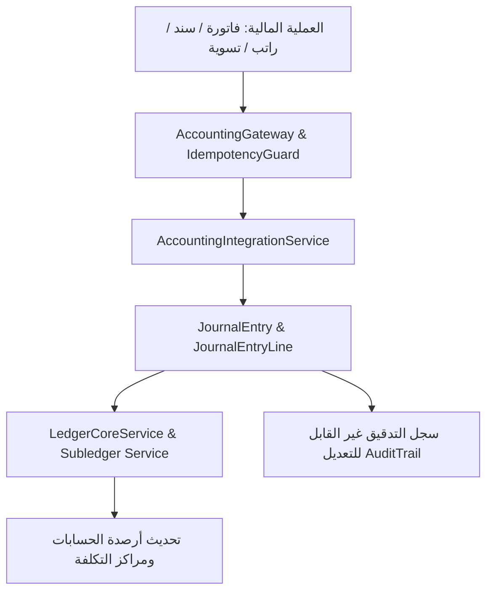

# MWHEBA ERP — Financial & Accounting Engine (المحرك المالي والمحاسبي)

> **وثيقة مرجعية تقنية ومعمارية** لمحرك الحسابات المزدوجة، منظومة تقييم فروق العملات الدولية (FX Engine)، الرقابة على الخزن، وإغلاق الفترات المالية في نظام **MWHEBA ERP**.

---

## 1. المعمارية المحاسبية المزدوجة (Double-Entry Engine Architecture)

يعتمد نظام **MWHEBA ERP** على محرك محاسبي صارم يتوافق مع معايير المحاسبة الدولية (IFRS/EAS). كافة العمليات المالية تمر عبر بوابة الحوكمة [`AccountingGateway`](file:///c:/Users/UTD/Desktop/MWHEBA%20ERP/governance/models.py) وتتحول إلى قيود يومية متوازنة ($\sum \text{Debit} = \sum \text{Credit}$).


```mermaid
graph TD
    A[العملية المالية: فاتورة / سند / راتب / تسوية] --> B[AccountingGateway & IdempotencyGuard]
    B --> C[AccountingIntegrationService]
    C --> D[JournalEntry & JournalEntryLine]
    D --> E[LedgerCoreService & Subledger Service]
    E --> F[تحديث أرصدة الحسابات ومراكز التكلفة]
    D --> G[سجل التدقيق غير القابل للتعديل AuditTrail]
```

---

## 2. إدارة العملات المتعددة ومحرك تقييم فروق العملة (Multi-Currency & FX Engine)

يدعم النظام التعامل متعدد العملات على مستوى كافة المستندات (فواتير، سندات، حسابات بنكية، عملاء، وموردين).

### 2.1 معايير دقة العملات والأرصدة الافتتاحية:
* **دقة المبالغ:** `decimal_places=2` للمبالغ المحلية والأجنبية.
* **دقة أسعار الصرف:** `decimal_places=6` لأسعار التحويل (`exchange_rate`).
* **الأرصدة الافتتاحية المزدوجة:** دعم تسجيل الرصيد بالعملة الأجنبية (`opening_balance_foreign`) وسعر الصرف التاريخي (`opening_balance_rate`).

### 2.2 محرك إعادة تقييم العملات الدولية (FX Revaluation Engine):
يقع المحرك تحت مسار [`financial/fx/`](file:///c:/Users/UTD/Desktop/MWHEBA%20ERP/financial/fx/) ويعمل وفق مبادئ Domain-Driven Design (DDD):

```
financial/fx/
├── models/
│   ├── revaluation_run.py      ← سجل جلسة التقييم (FXRevaluationRun)
│   ├── revaluation_line.py     ← سطور الحسابات والبنود المفتوحة (FXRevaluationLine)
│   ├── rate_snapshot.py        ← لقطة أسعار الصرف المعتمدة (FXRateSnapshot)
│   └── approval_workflow.py    ← دورة اعتماد فروق التقييم وتجاوز الأسعار
└── services/
    ├── fx_calculation_service.py ← احتساب أرباح/خسائر فروق العملة غير المحققة
    ├── fx_validation_service.py  ← التحقق من العمر الزمني للأسعار والقفل
    ├── fx_posting_service.py     ← ترحيل قيود فروق التقييم آلياً
    └── fx_reversal_service.py    ← إنشاء قيود العكس عند إعادة فتح الفترات
```

### 2.3 ضوابط أمان تقييم العملات (FX Governance Rules):
1. **قفل التزامن (Concurrency Lock & Idempotency):** استخدام الهاش المصدري (`source_hash`) والقيود الفريدة المشروطة لمنع التقييم المزدوج لنفس الفترة.
2. **حارس عمر سعر الصرف (Rate Age Guard):** إذا تجاوز عمر سعر الصرف المعتمد 7 أيام، يتطلب النظام موافقة المدير المالي (`RATE_OVERRIDE_APPROVAL`) قبل الترحيل.
3. **معالجة فروق السنتات (Penny Differences Handling):** الفروق الطفيفة الناتجة عن التقريب الرياضي ($\le 0.05$) أثناء التحويلات والمدفوعات يتم ترحيلها آلياً إلى حساب **«فروق التقريب والعملة»** لضمان توازن القيد بدقة مطلقة.

---

## 3. منظومة أمان ورقابة الخزن النقدية (Treasury Security & Cash Management)

تتولى خدمة [`TreasurySecurityService`](file:///c:/Users/UTD/Desktop/MWHEBA%20ERP/financial/services/treasury_security_service.py) إدارة الرقابة على حركة النقدية:
* **صلاحيات الوصول للخزائن:** تقييد إمكانية القبض، الصرف، أو التحويل النقدي بحسب تعيين المستخدم على الخزينة أو منحه صلاحية صريحة.
* **التحويلات بين الخزن والعملات المتقاطعة (`CashTransferService`):**
  * خصم من الخزينة المصدرة وإيداع في الخزينة المستهدفة بقيد محاسبي مركب واحد.
  * احتساب وترحيل أرباح/خسائر تقييم العملة المحققة (Realized FX Gains/Losses) فورياً عند التحويل بين عملتين مختلفتين.

---

## 4. منظومة العهد النقدية للموظفين (Employee Custody System)

تتيح خدمة [`CustodyService`](file:///c:/Users/UTD/Desktop/MWHEBA%20ERP/financial/services/custody_service.py) إدارة العهد النقدية المؤقتة والمستديمة:
1. **صرف العهدة (`Disburse Custody`):** إنشاء قيد من الخزينة النقدية إلى حساب عهدة الموظف في الدليل.
2. **تسوية مصروفات العهدة (`Custody Expenses`):** إدخال فواتير ومستندات الصرف وتوزيعها على مراكز التكلفة وحسابات المصروفات.
3. **تصفية وإغلاق العهدة (`Close / Settle Custody`):** رد المتبقي النقدي إلى الخزينة وتسوية أي فروق محاسبياً مع طباعة كشف تسوية عهدة معتمد.

---

## 5. رقابة وإغلاق الفترات المالية والسنوات (Period Control & Closing)

تتحكم خدمة [`PeriodControlService`](file:///c:/Users/UTD/Desktop/MWHEBA%20ERP/financial/services/period_control_service.py) و [`FiscalYearClosingService`](file:///c:/Users/UTD/Desktop/MWHEBA%20ERP/financial/services/fiscal_year_closing_service.py) في دورات الإغلاق:

* **الإغلاق الآلي للفترة (Period Close Automation):**
  * التحقق من ترحيل كافة العمليات المعلقة.
  * تشغيل محرك إعادة تقييم العملات الأجنبية آلياً وتثبيته بتاريخ نهاية الفترة (`period.end_date`).
  * منع أي تعديل أو إضافة قيود بتاريخ يقع ضمن الفترة المغلقة.
* **إعادة فتح الفترة وسجل التدقيق (Period Re-open Audit Trail):**
  * عند إعادة فتح فترة مغلقة، يمنع النظام الحذف الصلب (Hard Delete) لقيود التقييم السابقة.
  * يتم توليد قيود عكسية موثقة عبر `FXReversalService` لضمان الامتثال التام لمعايير المراجعة.

---

## 6. التقارير المالية ومطابقة البنوك (Financial Reports & Reconciliation)

* **ميزان المراجعة وقائمة الدخل والميزانية العمومية:**
  تعتمد الخدمات [`TrialBalanceService`](file:///c:/Users/UTD/Desktop/MWHEBA%20ERP/financial/services/trial_balance_service.py), [`IncomeStatementService`](file:///c:/Users/UTD/Desktop/MWHEBA%20ERP/financial/services/income_statement_service.py), و [`BalanceSheetService`](file:///c:/Users/UTD/Desktop/MWHEBA%20ERP/financial/services/balance_sheet_service.py) على استعلامات SQL مجمعة محسنة مع استخدام كاش `Redis` للتقارير الثقيلة.
* **تسوية ومطابقة الحسابات البنكية (`BankReconciliationService`):**
  مطابقة كشوف حساب البنك المستوردة من ملفات Excel/CSV مع قيود اليومية وتحديد المعاملات المعلقة آلياً.
