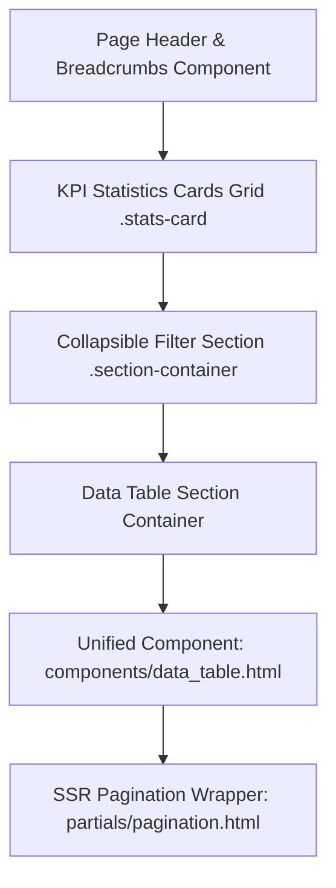

# MWHEBA ERP — Frontend & Design System Guide (دليل الواجهات ونظام التصميم الموحد)

> **وثيقة معايير الواجهات والتصميم** المعتمدة في نظام **MWHEBA ERP** لضمان التناسق البصري، الأداء العالي، وتجربة المستخدم المؤسسية الهادئة.

---

## 1. فلسفة التصميم ومعمارية الألوان (Design Tokens & Color Architecture)

يتبع النظام تصميماً مؤسسياً هادئاً (Calm, Minimal, Elegant & Corporate) مبنياً على القواعد الصارمة التالية:

1. **الاعتماد الحصري على متغيرات CSS (`:root Variables`):**
   * يُمنع منعاً باتاً كتابة الألوان بصيغ ثابتة (Hex `#fff` أو `rgb()` أو `hsl()`) داخل ملفات الـ CSS أو قوالب الـ HTML.
   * يجب استخدام المتغيرات المعرفة في `:root` حصراً (مثل `var(--primary-color)`, `var(--border-color)`, `var(--surface-color)`, `var(--text-main)`).
2. **حظر التدرجات اللونية (Strictly Flat Colors — No Gradients):**
   * يُمنع استخدام الـ CSS Gradients أو الخلفيات المتدرجة في كافة أجزاء النظام للحفاظ على الطابع المؤسسي النظيف والواضح.
3. **ثبات الخطوط (Typography Preservation):**
   * يُمنع تحميل أو تغيير الخطوط المعتمدة للنظام للحفاظ على توازن الطباعة العربي والإنجليزي.

---

## 2. معمارية صفحات العرض والقوائم (Standardized ListView Architecture)

تلتزم جميع صفحات القوائم والجداول في كافة الموديولات بهيكل موحد وقابل لإعادة الاستخدام:

### 2.1 هيدر الصفحة والمسار (Page Header & Breadcrumbs):
* استخدام المكون المشترك ``.
* تمرير مصفوفة مسار منظمة `breadcrumb_items` تبدأ دائماً بـ `core:dashboard`، تليها أقسام الموديول، وتنتهي بالعنصر النشط (`'active': True`).
* أزرار العمليات الرئيسية (مثل «إضافة جديد»، «تصدير»، «طباعة») توضع حصراً في الـ `header_buttons` داخل هيدر الصفحة، ويُمنع وضعها داخل عناوين الجداول.

### 2.2 بطاقات الإحصاءات والمؤشرات (`.stats-card`):
* توضع مباشرة داخل شبكة الـ Bootstrap: `
`.
* **قاعدة هامة:** يُمنع لف بطاقات الـ KPI داخل `.section-container` أو `.section-title`.
* استخدام الفئات المعيارية: `.stats-card-info`, `.stats-card-warning`, `.stats-card-success`, `.stats-card-danger`.

### 2.3 قسم الفلاتر القابل للطي (Collapsible Filters):
* يوضع داخل `.section-container.mb-4` مع استخدام `data-bs-toggle="collapse"`.
* القوائم المنسدلة تستخدم `.select2-filter` مع الضبط للغة العربية والـ RTL (`dir: "rtl"`, `language: "ar"`).

### 2.4 البحث التفاعلي عبر AJAX (`window.doSearch`):
* تحديث حاوية الجدول `#<module>-table-container` والـ `#pagination-wrapper` ديناميكياً بدون إعادة تحميل الصفحة.
* مزامنة حالة الرابط في المتصفح عبر `history.replaceState` لضمان بقاء الفلاتر عند مشاركة الرابط أو الرجوع.

---

## 3. المعايير الموحدة للنوافذ المنبثقة (Corporate Modal Architecture)

جميع النوافذ المنبثقة (Modals) تتبع المعايير المؤسسية التالية:

1. **المحاذاة والعمق:**
   * محاذاة في المنتصف دائماً: `
`.
   * حواف ناعمة بدون إطارات وظل عميق: `
`.
2. **رأس النافذة (`.modal-header`):**
   * خلفية رمادية فاتحة مع خط فاصل: `
`.
   * يُمنع استخدام الرؤوس الملونة المصمتة (`bg-primary`, `bg-dark`) أو الأزرار البيضاء `btn-close-white`.
   * العنوان: `<h5 class="modal-title fw-bold text-dark mb-0"><i class="fas fa-... text-primary me-2"></i>العنوان</h5>`.
3. **تكامل Select2 داخل الـ Modals:**
   * عند استخدام قوائم Select2 داخل النوافذ، يجب تمرير الخيار `dropdownParent: $('#modal_id')` لمنع فتح القائمة خلف طبقة التعتيم (Backdrop).

---

## 4. نظام الإشعارات والتنبيهات الموحد (Toastr Notifications Standard)

* **الدالة الموحدة:** استخدام `window.showNotification(message, type, title)` أو `window.showToastr(message, type)`.
* **تأخير إعادة التحميل (Toast Delay):** في العمليات التي تتطلب إعادة تحميل الصفحة بعد نجاح العملية، يجب ضبط الـ `setTimeout` بمدة **لا تقل عن 3100ms (3.1 ثانية)** لإتاحة اكتمال شريط التقدم الأنيميشن بنسبة 100% بسلاسة قبل التحديث.

---

## 5. مخرجات الطباعة والـ PDF والفواتير الحرارية (Printing & PDF Outputs)

* **قوالب الطباعة مقاس A4:** معتمدة على شبكة طباعة نظيفة مع هوامش مخصصة للطباعة المزدوجة ورمز الاستجابة السريعة (QR Code).
* **الفواتير الحرارية (Thermal POS Receipts - 80mm):** تخطيط مخصص مضغوط يدعم الطابعات الحرارية بدون تقطيع للنصوص مع دعم الترويسة وشروط الفاتورة.
