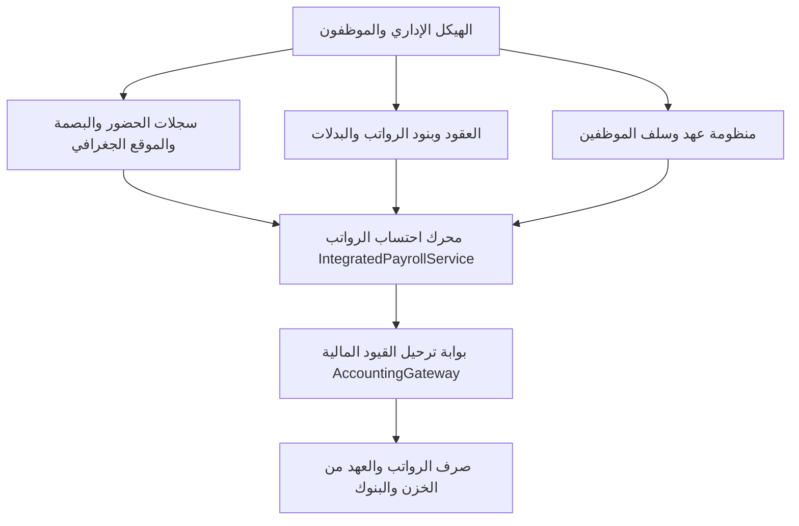

# نظام الموارد البشرية والرواتب والعهد — MWHEBA ERP

> **وثيقة مرجعية تقنية وتشغيلية** لنظام إدارة الموارد البشرية، مسيرات الرواتب الذكية، أجهزة البصمة، تسجيل الحضور بالموقع الجغرافي، وإدارة عهد الموظفين في **MWHEBA ERP**.

---

## 1. نظرة عامة والهيكل العام (HR Modules Architecture)

يغطي موديول الموارد البشرية (`hr`) الدورة الكاملة لحياة الموظف في المؤسسة، ويرتبط آلياً بالنظام المالي وبوابة الحسابات المزدوجة.

---

## 2. المكونات الرئيسية للموديول

| القسم | المسار (URL) | الوصف التقني والخدمات الملحقة |
|-------|--------------|-------------------------------|
| **إدارة الموظفين** | `/hr/employees/` | بيانات الموظفين، الأقسام، المسميات، والورديات (`EmployeeService`). |
| **العقود وهيكل الأجور** | `/hr/contracts/` | العقود الموحدة وبنود الراتب الثابتة والمتغيرة (`UnifiedContractService`). |
| **الحضور وسجلات البصمة** | `/hr/attendance/` | سجلات الحضور، تقارير التأخير، ومطابقة ساعات العمل (`AttendanceService`). |
| **تسجيل الحضور بالموبايل** | `/hr/mobile-punch/` | إثبات الحضور مع التحقق من النطاق الجغرافي (`MobilePunchService`, `GeofencingService`). |
| **أجهزة البصمة البيومترية** | `/hr/biometric/` | إدارة الأجهزة والربط المباشر عبر ZKTeco (`BiometricService`). |
| **الإجازات والأذونات** | `/hr/leaves/` | رصيد الإجازات، الإجازات السنوية، والاحتساب التراكمي (`LeaveService`). |
| **السلف والمكافآت والجزاءات** | `/hr/advances/` | طلبات السلف النقدية، الجزاءات، والمكافآت مع الخصم الآلي من الراتب. |
| **عهد الموظفين** | `/hr/custodies/` | صرف وتسوية وتصفية العهد النقدية للموظفين (`CustodyService`). |
| **مسيرات الرواتب** | `/hr/payroll/` | احتساب وصرف الرواتب والترحيل المالي المباشر (`PayrollService`). |

---

## 3. منظومة عهد الموظفين (Employee Custody System)

تم بناء منظومة متكاملة لإدارة العهد النقدية المؤقتة والمستديمة للموظفين الميدانيين ومسؤولي المشتريات:

### 3.1 دورة حياة العهدة (Custody Lifecycle):
1. **طلب وصرف العهدة (`EmployeeCustody`):**
   * تحديد الموظف المسؤول، المبلغ، الخزينة النقدية المصدرة، والغرض من العهدة.
   * توليد قيد صرف آلي: **من حـ/ عهد الموظفين (الموظف) إلى حـ/ الخزينة النقدية**.
2. **تسجيل مصروفات العهدة (`CustodyExpense`):**
   * إدخال بنود المصروفات مع إرفاق الفواتير وتحديد مراكز التكلفة وحسابات المصروفات المختصة.
   * احتساب الرصيد المتبقي لدى الموظف لحظياً.
3. **تصفية وإغلاق العهدة (`Custody Settlement`):**
   * توريد النقدية المتبقية إلى الخزينة عبر سند قبض/إيداع.
   * إقفال العهدة وترحيل قيد المصروفات النهائي مع طباعة تقرير تصفية عهدة رسمي.

---

## 4. الحضور والانصراف والبصمة والموقع الجغرافي

### 4.1 خيارات تسجيل الحضور المتعددة:
* **المزامنة مع أجهزة البصمة (ZKTeco Biometric Devices):** مزامنة تلقائية للسجلات عبر بروتوكول UDP/TCP وتعيين البصمة للموظف.
* **تسجيل الحضور عبر الموبايل (Mobile Punch & Geofencing):**
  * التحقق من موقع الموظف الجغرافي (GPS Coordinates) ومطابقته لنطاق الشركة المسموح به (`radius` بالأمتار).
  * منع التلاعب بالموقع عبر خوارزميات كشف الـ Mock Location.

### 4.2 محرك احتساب ساعات العمل والورديات:
* احتساب التأخير، الانصراف المبكر، وساعات العمل الإضافي (Overtime).
* التنسيق الذكي للأوقات (مثال: "8 ساعات و 30 دقيقة"، "30 د تأخير").

---

## 5. محرك الرواتب والترحيل المالي (Integrated Payroll & Accounting)

يقوم المحرك المركزي [`PayrollService`](file:///c:/Users/UTD/Desktop/MWHEBA%20ERP/hr/services/payroll_service.py) باحتساب مسير الرواتب الشهري:

$$\text{Net Salary} = \text{Basic Salary} + \text{Allowances (بدلات)} + \text{Rewards} - (\text{Absence/Delays} + \text{Penalties} + \text{Advances Deductions} + \text{Insurance/Tax})$$

* **الترحيل المحاسبي التلقائي:** إنشاء قيد استحقاق الرواتب وقيد صرف الرواتب عبر البنوك والخزن دفعة واحدة مع قفل المسير لمنع التعديل المزدوج.
