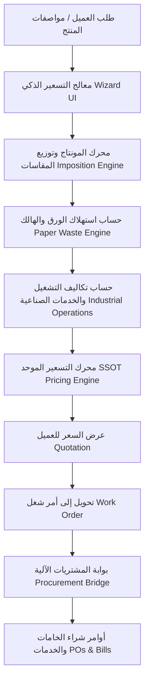

# MWHEBA ERP — Printing Pricing & Work Orders System (منظومة تسعير المطبوعات وأوامر الشغل)

> **وثيقة مرجعية تقنية متكاملة** لمحرك تسعير المطبوعات، حسابات المونتاج وتوزيع المقاسات، تتبع الهالك، وبوابة المشتريات والتكاليف الصناعية في نظام **MWHEBA ERP**.

---

## 1. نظرة عامة (Overview)

موديول **`printing_pricing`** و **`work_order`** يمثلان المحرك الصناعي الأساسي لنظام **MWHEBA ERP**. تم تصميمه ليتعامل مع التعقيدات الهندسية والمالية لمطابع الأوفست والديجيتال الكبرى، حيث يقوم بتحويل متطلبات العميل المعقدة (مقاس المنتج، نوع الورق، الجراماج، عدد الألوان، السلوفان، البصمة، التكسير، التجميع) إلى تكلفة دقيقة وسعر بيع موصى به عبر محرك حسابي موحد غير قابل للتلاعب (**SSOT Engine**).

---

## 2. معمارية محرك التسعير الموحد (Single Source of Truth - SSOT)

تم بناء محرك التسعير في الخدمة المركزية [`PricingCalculationEngine`](file:///c:/Users/UTD/Desktop/MWHEBA%20ERP/printing_pricing/services/pricing_engine.py) ليضمن أن أي عملية تسعير (سواء من واجهة الويب، الـ API، عروض الأسعار، أو التعديلات الإدارية) تمر بنفس المعادلات الفيزيائية والمالية بنسبة 100%.

### 2.1 تدفق الحسابات الهندسية:

1. **تحليل أبعاد المنتج (Product Dimensions & Imposition):**
   * مطابقة مقاس المنتج المفتوح والمقفول ($W \times H$) مع مقاسات أفرخ الورق القياسية ($70 \times 100$, $66 \times 88$, $60 \times 90$, إلخ).
   * حساب عدد النسخ الممكنة في الفرخ الواحد (Ups per Sheet) مع احتساب هوامش البنسة والتكعيب (Gripper & Bleed Margins).

2. **حساب صافي وهالك الورق (Paper Consumption & Scrap):**
   $$\text{Total Sheets} = \left\lceil \frac{\text{Required Quantity}}{\text{Ups per Sheet}} \right\rceil + \text{Setup Waste (زنكات وتظبيط)} + \text{Running Waste (\% هالك تشغيل)}$$
   $$\text{Weight in KG} = \frac{\text{Sheet Width (cm)} \times \text{Sheet Height (cm)} \times \text{Grammage (gsm)}}{10,000,000} \times \text{Total Sheets}$$

3. **تكاليف مراحل الإنتاج (Operation Stages Costing):**
   * **الطباعة (Printing Costs):** عدد الزنكات (Plates/CTP) + تكلفة السحبات والألوان (Impression / Color pulls).
   * **التشطيب والخدمات السطحية (Finishing):** سلوفان (لامع/مط/مخملي)، يو في (Spot UV)، بصمة (Foil Stamping)، كوفراج (Embossing).
   * **التجهيز النهائي والتجليد (Binding & Die-cutting):** تكسير، ريجة، تجميع، خياطة، غراء حراري (Pur/Hotmelt)، دبوس.

---

## 3. محاكي المونتاج وتوزيع المقاسات (Imposition Visualizer)

يوفر النظام محاكاة بصرية تفاعلية وحسابات هندسية تتيح لمسؤول التسعير وأمين المخزن رؤية كيفية تقطيع الورق:
- دعم التوزيع المستقيم والمتداخل (Straight & Nested layouts).
- التحقق من اتجاه ألياف الورق (Grain Direction) لضمان جودة الطي والتجليد.
- التنبيه التلقائي في حال وجود هدر ورقي يتجاوز النسبة المقبولة (Waste Alert Threshold).

---

## 4. نموذج بيانات التشريح والخواص (Anatomy Persistence)

تستخدم منظومة التسعير نموذجاً معمارياً مرناً يوثق كافة المتغيرات الميكانيكية والتشغيلية لكل أمر تسعير عبر خدمة [`AnatomyPersistenceService`](file:///c:/Users/UTD/Desktop/MWHEBA%20ERP/printing_pricing/services/anatomy_persistence_service.py):

* **`PrintingOrder`:** رأس الطلب (العميل، نوع المطبوع، الكمية المطلوبة، التكلفة الإجمالية، هامش الربح، السعر النهائي).
* **`PrintingOrderItem`:** بنود الطلب (الغلاف، المتن، الملازم، الجيوب).
* **`ItemOperation`:** العمليات الملحقة بالبند وتكاليفها الصناعية وموردي الخدمات الخارجية.
* **`PaperStockLookup` & `MachineLookup`:** جداول التوافقية للماكينات ومقاسات الورق وسرعات السحب.

---

## 5. جسر المشتريات الآلي (Procurement Bridge)

تربط خدمة [`ProcurementBridgeService`](file:///c:/Users/UTD/Desktop/MWHEBA%20ERP/printing_pricing/services/procurement_bridge.py) بين أوامر الإنتاج وموديول المشتريات:
1. **توليد طلبات الشراء تلقائياً:** فور اعتماد أمر الشغل (`WorkOrder`)، يقوم الجسر بفحص أرصدة المخزون لخامات الورق والأحبار المطلوبة.
2. **شراء النواقص والخدمات الخارجية:** إنشاء أوامر شراء (`PurchaseOrder`) أو فواتير خدمات موردين (`SupplierBill`) لخامات الورق الناقصة أو عمليات التشطيب المسندة لموردين خارجيين (مثل ورش السلوفان أو البصمة).
3. **مطابقة التكاليف التقديرية بالحقيقية (Estimated vs. Actual Variance):** مقارنة تكلفة التسعير المحسوبة في `PrintingOrder` بالتكلفة الفعلية الواردة في فواتير الموردين لتحديث هوامش الربحية وكفاءة التسعير.

---

## 6. جداول البيانات وبذر الإعدادات المسبقة (Seeders & Lookups)

يتضمن الموديول بذور بيانات قياسية مهيأة عبر [`PricingLookupSeederService`](file:///c:/Users/UTD/Desktop/MWHEBA%20ERP/printing_pricing/services/pricing_lookup_seeder_service.py) تشمل:
- أنواع الورق القياسية: (كوشيه، دوبلكس، طبع، بريستول، كرافت، فانديك).
- مقاسات الزنكات والماكينات (ربع فرخ، نصف فرخ، فرخ كامل، 8 لون، 4 لون).
- شرائح أسعار التكسير والسلوفان والتجليد المحدثة دورياً.
