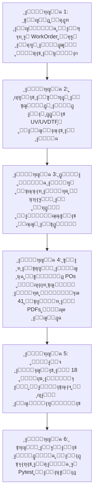

# ุงู„ุฎุทุฉ ุงู„ุชู†ููŠุฐูŠุฉ ุงู„ู…ุนู…ุงุฑูŠุฉ ุงู„ุดุงู…ู„ุฉ ู„ู…ู†ุธูˆู…ุฉ ุงู„ุชุณุนูŠุฑ ูˆุงู„ุฅู†ุชุงุฌ ูˆุงู„ู„ูˆุฌุณุชูŠุงุช ูˆุงู„ุญูˆูƒู…ุฉ ุงู„ูู†ูŠุฉ ูˆุงู„ู…ุงู„ูŠุฉ (Agency Master Plan 40.0 - Full Enterprise Edition)

## ๐Ÿ“Œ 1. ู†ู…ูˆุฐุฌ ุงู„ุนู…ู„ ูˆุงู„ุฑุคูŠุฉ ุงู„ู…ุนู…ุงุฑูŠุฉ ุงู„ู…ุนุชู…ุฏุฉ (Agency Business Model & Architecture)
ุชุทูˆูŠุฑ ูˆุชุญุฏูŠุซ ู…ู†ุธูˆู…ุฉ ุชุณุนูŠุฑ ุงู„ู…ุทุจูˆุนุงุช ูˆุงู„ู‡ุฏุงูŠุง ูˆุฎุฏู…ุงุช ุงู„ุชุดุบูŠู„ (`printing_pricing`) ููŠ **MWHEBA ERP** ู„ุชู„ุงุฆู… ุจุฏู‚ุฉ **ุดุฑูƒุงุช ุงู„ุฏุนุงูŠุฉ ูˆุงู„ุฅุนู„ุงู† ูˆุงู„ูˆุณุงุทุฉ ุงู„ุทุจุงุนูŠุฉ (Advertising Agencies & Print Brokers)** ุนุจุฑ ู…ุนู…ุงุฑูŠุฉ ู…ุญูƒู…ุฉ ุชุญู…ูŠ ุฃุฑุจุงุญ ุงู„ูˆูƒุงู„ุฉ ูˆุฃุณุฑุงุฑู‡ุง ุงู„ุชุฌุงุฑูŠุฉ ูˆุญู‚ูˆู‚ู‡ุง ุงู„ูู†ูŠุฉ ูˆุงู„ู‚ุงู†ูˆู†ูŠุฉ ูˆุงู„ู…ุงู„ูŠุฉ ูˆุงู„ุถุฑูŠุจูŠุฉุŒ ูˆุชุฑุจุท ุงู„ุฃู†ุดุทุฉ ุงู„ุชุฌุงุฑูŠุฉ ุงู„ุฃุณุงุณูŠุฉ ู…ุน ู…ูˆุฏูŠูˆู„ุงุช ุงู„ู†ุธุงู… (ุฃูˆุงู…ุฑ ุงู„ุดุบู„ุŒ ุงู„ู…ุจูŠุนุงุชุŒ ุงู„ู…ุดุชุฑูŠุงุชุŒ ุงู„ู…ุฎุงุฒู†ุŒ ุงู„ู„ูˆุฌุณุชูŠุงุชุŒ ูˆุงู„ุญุณุงุจุงุช ุงู„ุนุงู…ุฉ):
* **ู…ุธู„ุฉ ุฃู…ุฑ ุงู„ุดุบู„ ุงู„ู…ูˆุญุฏุฉ (Work Order Job-Costing Hub):** ุฑุจุท ุฑุฃุณ ุฃู…ุฑ ุงู„ุชุณุนูŠุฑ `PrintingOrder` ุจุฃู…ุฑ ุงู„ุดุบู„ `work_order.WorkOrder` ูƒู…ุฑูƒุฒ ุชูƒู„ูุฉ ูˆุฑุจุญูŠุฉ ู…ุตุบุฑุŒ ูˆุชุฑุญูŠู„ ู†ูุณ ุฑู‚ู… ุฃู…ุฑ ุงู„ุดุบู„ ุชู„ู‚ุงุฆูŠุงู‹ ุฅู„ู‰ ูƒุงูุฉ ุฃูˆุงู…ุฑ ุงู„ุดุฑุงุก `purchase.PurchaseOrder` ูˆู…ุตุฑูˆูุงุช ุงู„ุนู‡ุฏุฉ ุงู„ูŠูˆู…ูŠุฉ ุงู„ุตุงุฏุฑุฉ ู„ู„ูˆุฑุดุŒ ู„ุชูˆุญูŠุฏ ุฅูŠุฑุงุฏ ุงู„ุนู…ูŠู„ ูˆู…ุตุฑูˆูุงุช ุงู„ูˆุฑุด ูˆุญุณุงุจ ุตุงููŠ ุฑุจุญ ุงู„ุดุบู„ุงู†ุฉ ููŠ ุดุงุดุฉ ูˆุงุญุฏุฉ 360 ุฏุฑุฌุฉ.
* **ู…ุนู…ุงุฑูŠุฉ ุงู„ุชุฌู…ูŠุน ู„ู„ุนู…ูŠู„ ูˆุงู„ููƒ ู„ู„ูˆุฑุด (Bundled Client Invoice vs Unbundled Workshop POs):**
  * ุธู‡ูˆุฑ ุณุทุฑ ูˆุงุญุฏ ู…ุฌู…ุน ู†ุธูŠู ู„ู„ุนู…ูŠู„ ููŠ ุนุฑุถ ุงู„ุณุนุฑ ูˆุงู„ูุงุชูˆุฑุฉ ุงู„ุถุฑูŠุจูŠุฉ (ู…ุซุงู„: ูƒุชุงู„ูˆุฌ 64 ุตูุญุฉ ุจุณุนุฑ ุฅุฌู…ุงู„ูŠ).
  * ููƒ ุงู„ุดุบู„ุงู†ุฉ ุขู„ูŠุงู‹ ุฏุงุฎู„ ุงู„ู†ุธุงู… ุฅู„ู‰ ู…ุณุงุฑุงุช ุงู„ุชุดุบูŠู„ ุงู„ู…ู†ูุตู„ุฉ (ุฅุฐู† ุตุฑู ูˆุฑู‚ ุงู„ู…ุชู†ุŒ ุฅุฐู† ุตุฑู ูˆุฑู‚ ุงู„ุบู„ุงูุŒ ุฒู†ูƒุงุช CTPุŒ ุณุญุจ ุงู„ุฃูˆูุณุชุŒ ุงู„ุณู„ูˆูุงู†ุŒ ุงู„ุจุตู…ุฉุŒ ุงู„ุชูƒุณูŠุฑุŒ ูˆุงู„ุชุฌู„ูŠุฏ).
* **ุงู„ู…ุทุจูˆุนุงุช ุงู„ูˆุฑู‚ูŠุฉ ูˆุงู„ุชุฌุงุฑูŠุฉ (Commercial Printing):** (ุฃูˆูุณุชุŒ ุฏูŠุฌูŠุชุงู„ุŒ ูู„ุงูŠุฑุงุชุŒ ุจุฑูˆุดูˆุฑุงุชุŒ ููˆู„ุฏุฑุงุชุŒ ูƒุฑูˆุช ุดุฎุตูŠุฉุŒ ูˆุฑู‚ ู…ุฑูˆุณุŒ ุฃุธุฑูุŒ ุจูˆุณุชุฑุงุช) ุจุชุณุนูŠุฑ ุงู„ูˆุฑู‚ ุจุงู„ูุฑุฎ ู…ุน **ยซุญุณุงุจ ุงู„ู‡ุงู„ูƒ ุงู„ุชุฑุงูƒู…ูŠ ู„ูƒุงูุฉ ู…ุฑุงุญู„ ุงู„ูˆุฑุดยป**ุŒ ูˆูุญุต **ยซู…ุณุงูุฉ ุงู„ุฎุฑูˆุฌ Bleed 3mmยป**ุŒ ูˆุฅุฏุงุฑุฉ **ยซูุถู„ุงุช ุงู„ูˆุฑู‚ ุงู„ุตุงู„ุญุฉ ูˆุญุฒู… ุงู„ุจูˆุงูƒูŠ Usable Offcutsยป**ุŒ ูˆุชูˆู„ูŠุฏ **ยซุฅุฐู† ุตุฑู ู…ุฎุฒู†ูŠ ุขู„ูŠ ู„ุฃูุฑุฎ ุงู„ูˆุฑู‚ยป** ุนู†ุฏ ุงู„ุณุญุจ ู…ู† ู…ุฎุฒู† ุงู„ูˆูƒุงู„ุฉุŒ ูˆุฅุตุฏุงุฑ **ยซุฃู…ุฑ ุชุดุบูŠู„ ู…ุฌู…ุน ู„ู„ู…ุทุจุนุฉยป** ุนู†ุฏ ุชุนุฏุฏ ุงู„ุจู†ูˆุฏ.
* **ุงู„ู†ุดุฑ ูˆุงู„ุชุฌู„ูŠุฏ ุงู„ู…ุชุฎุตุต ูˆุงู„ุฏูุงุชุฑ ุงู„ูƒุฑุจูˆู†ูŠุฉ (Bookbinding, Calendars, & NCR):** (ูƒุชุจุŒ ุฑูˆุงูŠุงุชุŒ ูƒุชุงู„ูˆุฌุงุช ู…ู†ุชุฌุงุชุŒ ู…ุฌู„ุงุชุŒ ุฏูุงุชุฑ ููˆุงุชูŠุฑ ูƒุฑุจูˆู†ูŠุฉ NCRุŒ ูˆู†ุชุงุฆุฌ ุญุงุฆุท ูˆู…ูƒุชุจ ุจุณู„ูƒ Wire-O) ุจุฏุนู… ุทุฑู‚ ุงู„ุชุฌู„ูŠุฏ ุงู„ุฃุฑุจุนุฉ ูˆููŠุฒูŠุงุก ุณู…ูƒ ูƒุนุจ ุงู„ูƒุชุงุจ ูˆุงุชุฌุงู‡ ุฃู„ูŠุงู ุงู„ูˆุฑู‚ (Grain Direction).
* **ุงู„ู‡ุฏุงูŠุง ุงู„ุฏุนุงุฆูŠุฉ ู„ู„ุดุฑูƒุงุช (Corporate Giveaways & Merchandising):** (ุฃู‚ู„ุงู…ุŒ ู…ุฌุงุชุŒ ูู„ุงุดุงุช USBุŒ ุจุงูˆุฑ ุจู†ูƒุŒ ุฃุฌู†ุฏุงุช ุณู†ูˆูŠุฉุŒ ู…ูŠุฏุงู„ูŠุงุช) ุจุชุณุนูŠุฑ ุงู„ุฎุงู…ุฉ + ูุชุญุฉ ุงู„ู…ุงูƒูŠู†ุฉ + ุชูƒู„ูุฉ ุงู„ุทุจุงุนุฉ ู„ู„ู‚ุทุนุฉ + ุงุญุชูŠุงุทูŠ ูุญุต ุงู„ุฅู„ูƒุชุฑูˆู†ูŠุงุช 3%ุŒ ู…ุน **ยซุฅู‚ุฑุงุฑ ู†ุณุจุฉ ู‡ุงู„ูƒ ุฎุงู…ุงุช ุงู„ุนู…ูŠู„ ุงู„ู…ูˆุฑุฏุฉยป**.
* **ุฎุฏู…ุงุช ุงู„ู€ UV ูˆุงู„ู€ UV-DTF ุนู†ุฏ ุงู„ู…ูˆุฑุฏูŠู† (Outsourced Direct UV & UV-DTF Crystal Stickers):** ูƒุฎุฏู…ุฉ ุชุดุบูŠู„ ุฎุงุฑุฌูŠ ุจุงู„ุดูŠุช ุฃูˆ ุงู„ู…ุชุฑ ุงู„ุทูˆู„ูŠ ุฃูˆ ุงู„ู‚ุทุนุฉ ู…ุน ู…ุตู†ุนูŠุฉ ุงู„ู„ุตู‚ ูˆุงู„ุชุฌู…ูŠุน ุงู„ูŠุฏูˆูŠ.
* **ุฎุฏู…ุงุช ุงู„ุชุตู…ูŠู… ุงู„ุฌุฑุงููŠูƒูŠ ูˆุงู„ุฅุจุฏุงุน:** (ุฃุชุนุงุจ ุงู„ุชุตู…ูŠู… ุงู„ุฌุฏูŠุฏุŒ ุงู„ุชุนุฏูŠู„ ูˆุงู„ู…ูˆู†ุชุงุฌุŒ ูˆูุตู„ ุงู„ุฃู„ูˆุงู† ูˆุงู„ู€ Trapping ุงู„ู…ุชู‚ุฏู…).
* **ุงู„ู„ูˆุฌุณุชูŠุงุช ูˆุชุนุจุฆุฉ ุงู„ูƒุฑุงุชูŠู† ูˆุงู„ุดุญู† ู…ุชุนุฏุฏ ุงู„ูุฑูˆุน (Multi-Drop Logistics & Carton Ergonomics):**
  * ุญุงุณุจุฉ ู…ุดุงูˆูŠุฑ ุงู„ู†ู‚ู„ ู…ุน **ยซุตู…ุงู… ุงู„ุญุฏ ุงู„ุฃุฏู†ู‰ ู„ู…ุตุงุฑูŠู ุงู„ุชูˆุตูŠู„ Minimum Drop Feeยป**ุŒ ูˆู…ุญุงุถุฑ ุงุณุชู„ุงู… ูˆุชุณู„ูŠู… ุงู„ุจูˆุงูƒูŠ ูˆุงู„ุฃูุฑุฎ ุจูŠู† ุงู„ูˆุฑุด ู„ุญู…ุงูŠุฉ ุงู„ูˆูƒุงู„ุฉ ู…ู† ุถูŠุงุน ุงู„ุฎุงู…ุงุชุŒ ูˆุชุญุฏูŠุฏ ุณู‚ู ูˆุฒู† ุงู„ูƒุฑุชูˆู†ุฉ (15-18 ูƒุฌู…) ู„ุณู„ุงู…ุฉ ุงู„ู†ู‚ู„ุŒ ูˆุชูˆุฒูŠุน ุงู„ุดุญู†ุงุช ุนู„ู‰ ุงู„ูุฑูˆุน ุจุฃุฐูˆู† ุชุณู„ูŠู… ู…ู†ูุตู„ุฉ.
* **ุงู„ุญูˆูƒู…ุฉ ุงู„ูู†ูŠุฉ ูˆุงู„ุฃู…ู†ูŠุฉ ูˆุงู„ุถุฑูŠุจูŠุฉ ูˆุงู„ู…ุงู„ูŠุฉ (Data Sanitization, GL Integrity, ETA Compliance & Retentions):**
  * ุญู…ุงูŠุฉ ุงู„ุฃุณุฑุงุฑ ุงู„ุชุฌุงุฑูŠุฉ ูˆุนุฒู„ ุจูŠุงู†ุงุช ุงู„ูˆุฑุด ูˆุงู„ุชูƒุงู„ูŠู ุงู„ุฏุงุฎู„ูŠุฉ ุชู…ุงู…ุงู‹ ุนู† ู…ู„ูุงุช ุงู„ู€ PDF ูˆุงู„ูˆุงุชุณุงุจ ุงู„ู…ุฑุณู„ุฉ ู„ู„ุนู…ูŠู„.
  * ู…ุนุงู„ุฌุฉ ุฏูุนุงุช ุงู„ุนู…ู„ุงุก ุงู„ู…ู‚ุฏู…ุฉ ูƒุงู„ุชุฒุงู… ู…ุชุฏุงูˆู„ (`Customer Advances`) ูˆุนุฑุงุจูŠู† ุงู„ูˆุฑุด ูƒุฃุตู„ ู…ุชุฏุงูˆู„ (`Supplier Advances`).
  * ูุตู„ ู…ุณุชู‚ุทุนุงุช ุญุณู† ุงู„ุชู†ููŠุฐ ูˆุถู…ุงู† ุงู„ุฃุนู…ุงู„ (5-10% Retentions) ูƒุจู†ุฏ ู…ุคุฌู„ ููŠ ุงู„ุญุณุงุจุงุช.
  * ุฎุตู… ุถุฑูŠุจุฉ ุงู„ู€ 1% ุฃูˆุชูˆู…ุงุชูŠูƒูŠุงู‹ ู…ู† ููˆุงุชูŠุฑ ุงู„ูˆุฑุด ูˆุชูˆุฌูŠู‡ู‡ุง ู„ู€ **ยซู†ู…ูˆุฐุฌ 41 ุถุฑุงุฆุจยป**.
  * ู‚ูู„ ุฃุฑู‚ุงู… ุงู„ุชุณู„ุณู„ ุจู€ `select_for_update()` ู„ู…ู†ุน ุชุถุงุฑุจ ุฃูƒูˆุงุฏ ุงู„ู…ู‚ุงูŠุณุงุช.

---

## ๐Ÿ›ก๏ธ 2. ุงู„ุฑูƒุงุฆุฒ ุงู„ู‡ู†ุฏุณูŠุฉ ูˆุงู„ุชุดุบูŠู„ูŠุฉ ูˆุงู„ูู†ูŠุฉ ูˆุงู„ุฃู…ู†ูŠุฉ (30 Core Pillars)

1. ๐Ÿ”„ **ู…ุนู…ุงุฑูŠุฉ (Single Invoice Line vs Multi-Part Procurement POs):**
   * ุฏู…ุฌ ุงู„ุฃุฌุฒุงุก ููŠ ุณุทุฑ ุจูŠุนูŠ ูˆุงุญุฏ ู„ู„ุนู…ูŠู„ ูˆููƒู‡ุง ุขู„ูŠุงู‹ ู„ุฃูˆุงู…ุฑ ุดุฑุงุก ูˆุฑุด ูˆุฃุฐูˆู† ุตุฑู ุฃูุฑุฎ ุงู„ูˆุฑู‚.
2. ๐Ÿ”’ **ุตู…ุงู… ุฅุทู„ุงู‚ ุฃูˆุงู…ุฑ ุงู„ุดุฑุงุก ุงู„ู…ุดุฑูˆุท (Gated PO Issuance):**
   * ุฑุจุท ุงู†ุชู‚ุงู„ ุฃู…ุฑ ุงู„ุดุฑุงุก ุฅู„ู‰ `ISSUED` ุจุงุนุชู…ุงุฏ ุงู„ุจุฑูˆูุฉ ูˆุณุฏุงุฏ ุงู„ุฏูุนุฉ ุงู„ู…ู‚ุฏู…ุฉ 50%.
3. ๐Ÿ›ก๏ธ **ุนุฒู„ ูˆุชุทู‡ูŠุฑ ุจูŠุงู†ุงุช ู…ู„ูุงุช ุงู„ู€ PDF ูˆุงู„ูˆุงุชุณุงุจ (Trade Secret Data Sanitization):**
   * ุนุฒู„ ูƒุงู…ู„ ู„ุจูŠุงู†ุงุช ูˆุฃุณู…ุงุก ุงู„ูˆุฑุด ูˆุชููƒูŠูƒ ุงู„ุชูƒุงู„ูŠู ุงู„ุฏุงุฎู„ูŠุฉ ุนู† ุฃูŠ ู…ู„ู PDF ุฃูˆ ุฑุงุจุท ูˆุงุชุณุงุจ ูŠูุฑุณู„ ู„ู„ุนู…ูŠู„.
4. โœ‚๏ธ **ูุญุต ู…ุณุงูุฉ ุงู„ุฎุฑูˆุฌ ูˆุงู„ุจู†ุณุฉ (3mm Bleed Prepress Guard):**
   * ูุญุต ุฅู„ุฒุงู…ูŠ ู„ุฃุจุนุงุฏ ุงู„ุชุตู…ูŠู… ูˆูˆุฌูˆุฏ 3 ู…ู… ุฎุฑูˆุฌ ู‚ุจู„ ุฅุฑุณุงู„ ุงู„ู…ู„ู ู„ู…ุฑูƒุฒ ุงู„ุฒู†ูƒุงุช ู„ู…ู†ุน ุธู‡ูˆุฑ ุงู„ุญูˆุงู ุงู„ุจูŠุถุงุก ุนู†ุฏ ุงู„ู‚ุต.
5. ๐Ÿ“ฆ **ุณู‚ู ูˆุฒู† ุงู„ูƒุฑุชูˆู†ุฉ ู„ุณู„ุงู…ุฉ ุงู„ู†ู‚ู„ (15-18kg Ergonomic Carton Limit):**
   * ุงุญุชุณุงุจ ุนุฏุฏ ุงู„ูƒุฑุงุชูŠู† ูˆุชูˆุฒูŠุน ุงู„ูƒู…ูŠุงุช ุจุญูŠุซ ู„ุง ูŠุชุฌุงูˆุฒ ูˆุฒู† ุงู„ูƒุฑุชูˆู†ุฉ 18 ูƒุฌู… ู„ู…ู†ุน ุชู„ู ุงู„ู…ุทุจูˆุนุงุช ุฃุซู†ุงุก ุงู„ุดุญู†.
6. ๐Ÿ’ฑ **ุงู„ุชุญูˆุท ุถุฏ ุชู‚ู„ุจุงุช ุฃุณุนุงุฑ ุงู„ุนู…ู„ุฉ ููŠ ุงู„ุฎุงู…ุงุช ุงู„ู…ุณุชูˆุฑุฏุฉ (FX Currency Hedging Buffer):**
   * ุฑุจุท ุงู„ุฎุงู…ุงุช ุงู„ู…ุณุชูˆุฑุฏุฉ ุจุฃุณุนุงุฑ ุงู„ุตุฑู ุงู„ู„ุญุธูŠุฉ ูˆุฅุถุงูุฉ ู‡ุงู…ุด ุชุญูˆุท ุขู„ูŠ ุนู†ุฏ ุงู„ุฏูุน ุงู„ุขุฌู„.
7. ๐Ÿ›๏ธ **ุฅุฏุงุฑุฉ ู…ุณุชู‚ุทุนุงุช ุญุณู† ุงู„ุชู†ููŠุฐ ูˆุถู…ุงู† ุงู„ุฃุนู…ุงู„ (5-10% Performance Retentions):**
   * ู…ุนุงู„ุฌุฉ ู…ุณุชู‚ุทุนุงุช ุงู„ุถู…ุงู† ูƒุจู†ุฏ ู…ุคุฌู„ ููŠ ุงู„ุญุณุงุจุงุช ู„ุชุฌู†ุจ ุชุถู„ูŠู„ ุชู‚ุงุฑูŠุฑ ุฃุนู…ุงุฑ ุงู„ุฏูŠูˆู† ูˆุงู„ุชุญุตูŠู„.
8. ๐Ÿ“œ **ุตู…ุงู… ุงุชุฌุงู‡ ุฃู„ูŠุงู ุงู„ูˆุฑู‚ (Paper Grain Direction Guard):**
   * ุถุจุท ุชู‚ุทูŠุน ุงู„ูˆุฑู‚ ุจุญูŠุซ ูŠูƒูˆู† ุงุชุฌุงู‡ ุงู„ุฃู„ูŠุงู ู…ูˆุงุฒูŠุงู‹ ุฏุงุฆู…ุงู‹ ู„ูƒุนุจ ุงู„ูƒุชุงุจ ุฃูˆ ุฎุทูˆุท ุงู„ุทูŠ ููŠ ุงู„ุฃูˆุฒุงู† ุงู„ุซู‚ูŠู„ุฉ.
9. ๐Ÿงช **ูุฑุถ ุณู„ูˆูุงู† ุงู„ุฏูŠุฌูŠุชุงู„ ุงู„ู…ุนุฒุฒ (Ultra-Bond Digital Lamination):**
   * ุงู„ุชุจุฏูŠู„ ุงู„ุชู„ู‚ุงุฆูŠ ู„ุณู„ูˆูุงู† ุงู„ุฏูŠุฌูŠุชุงู„ ุฐูˆ ุงู„ุบุฑุงุก ุงู„ูƒุซูŠู ููŠ ุงู„ู…ุทุจูˆุนุงุช ุงู„ุฑู‚ู…ูŠุฉ ุฐุงุช ุงู„ุฎู„ููŠุงุช ุงู„ู…ุตู…ุชุฉ.
10. โฑ๏ธ **ุฑุตุฏ ุชูƒู„ูุฉ ุณุงุนุงุช ูˆู‚ูุฉ ุงู„ู…ุงูƒูŠู†ุงุช (Press Standby Hourly Rates):**
    * ุชุณุฌูŠู„ ุณุงุนุงุช ุชุนุทู„ ุงู„ู…ุงูƒูŠู†ุงุช ุนู†ุฏ ุนูŠูˆุจ ุงู„ุฒู†ูƒุงุช ุฃูˆ ุชุฃุฎุฑ ุงู„ุฎุงู…ุงุช ูˆุชุญู…ูŠู„ู‡ุง ููŠ ู…ุตููˆูุฉ COPQ.
11. ๐ŸŽจ **ุตู…ุงู… ุชุฌููŠู ุฃุญุจุงุฑ ุงู„ุจุงู†ุชูˆู† ูˆุงู„ูˆุฑู†ูŠุด ุงู„ู…ุงุฆูŠ (Anti-Set-off Guard):**
    * ูุฑุถ ูˆุฑู†ูŠุด ู…ุงุฆูŠ ุณุฑูŠุน ุงู„ุฌูุงู ููŠ ุงู„ุทู„ุจูŠุงุช ุงู„ู…ุณุชุนุฌู„ุฉ ุฐุงุช ุงู„ู…ุณุงุญุงุช ุงู„ู…ุตู…ุชุฉ ู„ู…ู†ุน ุชู„ุทูŠุฎ ุงู„ุฃุญุจุงุฑ.
12. ๐Ÿ“ฑ **ูุญุต ู‚ุฑุงุกุฉ ุงู„ุจุงุฑูƒูˆุฏ ูˆุงู„ู€ QR ุจุงู„ู…ุงุณุญ ุงู„ุถูˆุฆูŠ (Optical Scannability Test):**
    * ูุญุต ุฅู„ุฒุงู…ูŠ ุจุงู„ู…ุงุณุญ ุงู„ุถูˆุฆูŠ ููŠ ุจูˆุงุจุฉ ุงู„ุฌูˆุฏุฉ QC ู„ู„ุชุฃูƒุฏ ู…ู† ู‚ุฑุงุกุฉ ุงู„ุฃูƒูˆุงุฏ ุจู†ุณุจุฉ 100% ู‚ุจู„ ุงู„ุชุนุจุฆุฉ.
13. โšก **ู‚ูู„ ุงู„ุชุฒุงู…ู† ุงู„ุฐุฑูŠ ู„ู„ุฃุฑู‚ุงู… ุงู„ุชุณู„ุณู„ูŠุฉ (Sequence Concurrency Lock):**
    * ุชุฃู…ูŠู† ุชูˆู„ูŠุฏ ุฃูƒูˆุงุฏ `PR` ุจู€ `select_for_update()` ุฏุงุฎู„ ู…ุนุงู…ู„ุงุช ุฐุฑูŠุฉ ู„ู…ู†ุน ุชูƒุฑุงุฑ ุงู„ุฃูƒูˆุงุฏ ุนู†ุฏ ุถุบุท ุงู„ู…ุจูŠุนุงุช.
14. ๐Ÿ›๏ธ **ุงู„ุฎุตู… ูˆุงู„ุฅุถุงูุฉ ุงู„ุขู„ูŠ ูˆู†ู…ูˆุฐุฌ 41 ุถุฑุงุฆุจ (Automated 1% WHT Form 41):**
    * ุฎุตู… 1% ู…ู† ู…ุณุชุญู‚ุงุช ุงู„ูˆุฑุด ูˆุชูˆุฌูŠู‡ู‡ุง ู„ุญุณุงุจ ูˆุณูŠุท `WHT Payable` ู„ุถู…ุงู† ุตุญุฉ ุงู„ุฅู‚ุฑุงุฑุงุช ุงู„ุถุฑูŠุจูŠุฉ.
15. ๐Ÿ›ก๏ธ **ุขู„ุฉ ุงู„ุญุงู„ุงุช ุงู„ุตุงุฑู…ุฉ ูˆุญู…ุงูŠุฉ ุงู„ุญุฌูˆุฒุงุช (State Machine Invariants):**
    * ู…ู†ุน ุงู„ุชุนุฏูŠู„ ุงู„ู…ุจุงุดุฑ ุนู„ู‰ ุงู„ุฃูˆุฑุฏุฑุงุช ุงู„ู…ุคูƒุฏุฉ ูˆู‚ูู„ ุงู„ุญุฌูˆุฒุงุช ูˆุฅู„ุฒุงู…ูŠุฉ ู…ู„ุญู‚ ุงู„ุชุนุฏูŠู„ ุงู„ุทุงุฑุฆ `ChangeOrder`.
16. ๐Ÿงพ **ุชูˆุงูู‚ ุงู„ููˆุงุชูŠุฑ ุงู„ุฅู„ูƒุชุฑูˆู†ูŠุฉ ู…ุน ุงู„ุชุณู„ูŠู… ุงู„ู…ุฌุฒุฃ (Partial ETA E-Invoicing):**
    * ุฅุตุฏุงุฑ ููˆุงุชูŠุฑ ุถุฑูŠุจูŠุฉ ู…ุฌุฒุฃุฉ ู…ุฑุชุจุทุฉ ุจุฃุฐูˆู† ุงู„ุชุณู„ูŠู… ุงู„ูุนู„ูŠุฉ ู„ูƒู„ ุดุญู†ุฉ ู…ู†ุนุงู‹ ู„ู…ุฎุงู„ูุงุช ุงู„ุถุฑุงุฆุจ.
17. ๐Ÿš€ **ุชุณุฑูŠุน ุงุณุชุนู„ุงู…ุงุช ุฃุณุนุงุฑ ุงู„ูˆุฑู‚ ูˆุงู„ุฎุฏู…ุงุช (Paper Price Memory Cache):**
    * ุชุฎุฒูŠู† ู…ุคู‚ุช ูุงุฆู‚ ุงู„ุณุฑุนุฉ ู„ุฃุณุนุงุฑ ุฃูุฑุฎ ุงู„ูˆุฑู‚ ุงู„ุดุงุฆุนุฉ ู„ุถู…ุงู† ุงุณุชุฌุงุจุฉ ุดุงุดุฉ ุงู„ุชุณุนูŠุฑ ููŠ ุฃู‚ู„ ู…ู† 50ms.
18. ๐Ÿ“œ **ุงู„ุฅู‚ุฑุงุฑ ุงู„ู‚ุงู†ูˆู†ูŠ ู„ูุฑูˆู‚ ุฏุฑุฌุงุช ุงู„ุฃู„ูˆุงู† ุจุงู„ุจุฑูˆูุฉ ุงู„ุฑู‚ู…ูŠุฉ (RGB vs CMYK Legal Disclaimer):**
    * ุชูˆุซูŠู‚ ุฅู‚ุฑุงุฑ ู…ู„ุฒู… ูŠูˆุถุญ ูุฑูˆู‚ ุงู„ุฃู„ูˆุงู† ุงู„ุทุจุงุนูŠุฉ CMYK ุนู† ุดุงุดุงุช ุงู„ุนุฑุถ RGB ุจู†ุณุจุฉ 5-8%.
19. ๐Ÿšš **ู…ุญุถุฑ ุงู„ุชุณู„ูŠู… ูˆุงู„ุชุณู„ู… ูˆุณู„ุณู„ุฉ ุงู„ุนู‡ุฏุฉ ุจูŠู† ุงู„ูˆุฑุด (Workshop Handoff Relay):**
    * ุฅุซุจุงุช ุนุฏุฏ ุงู„ุฃูุฑุฎ ุงู„ู…ุณู„ู…ุฉ ูˆุงู„ู…ุณุชู„ู…ุฉ ุจูŠู† ู…ุญุทุงุช ุงู„ูˆุฑุด ู„ู…ู†ุน ุฅู„ู‚ุงุก ู…ุณุคูˆู„ูŠุฉ ุงู„ู†ู‚ุต ูˆุงู„ุชู„ู ุนู„ู‰ ุงู„ูˆูƒุงู„ุฉ.
20. ๐Ÿงฉ **ู‚ูู„ ุชูƒุงู„ูŠู ุงู„ุทุจุงุนุฉ ุงู„ุชุฌู…ูŠุนูŠุฉ (Gang-Run Shared Cost Lock):**
    * ุชุฌู…ูŠุฏ ุญุตุต ุงู„ุชูƒู„ูุฉ ุงู„ุซุงุจุชุฉ ุจูŠู† ุงู„ุนู…ู„ุงุก ูˆุชุญู…ูŠู„ ุชูƒู„ูุฉ ุฃูŠ ุชุนุฏูŠู„ ุทุงุฑุฆ ุนู„ู‰ ุงู„ุนู…ูŠู„ ุงู„ู…ุชุณุจุจ ุฏูˆู† ุงู„ุฅุถุฑุงุฑ ุจุจุงู‚ูŠ ุงู„ุดุฑูƒุงุก.
21. ๐Ÿ’ต **ุงุณุชุญู‚ุงู‚ ุนู…ูˆู„ุงุช ุงู„ู…ุจูŠุนุงุช ุจุงู„ุชุญุตูŠู„ ุงู„ู†ู‚ุฏูŠ ุงู„ูุนู„ูŠ (Commission on Actual Cash Inflow):**
    * ุตุฑู ุนู…ูˆู„ุฉ ุงู„ู…ู†ุฏูˆุจ ุจู†ุณุจุฉ ู…ุง ุชู… ุชุญุตูŠู„ู‡ ูุนู„ูŠุงู‹ ููŠ ุงู„ุฎุฒู†ุฉ ู„ุญู…ุงูŠุฉ ุงู„ูˆูƒุงู„ุฉ ู…ู† ุฎุณุงุฆุฑ ุงู„ุฏูŠูˆู† ุงู„ู…ุนุฏูˆู…ุฉ.
22. ๐Ÿ“ฆ **ุฅู‚ุฑุงุฑ ู†ุณุจุฉ ู‡ุงู„ูƒ ุฎุงู…ุงุช ุงู„ุนู…ูŠู„ ุงู„ู…ูˆุฑุฏุฉ (Customer-Supplied Material Scrap Waiver):**
    * ุฅู„ุฒุงู… ุงู„ุนู…ูŠู„ ุจู†ุณุจุฉ ู‡ุงู„ูƒ ุชุดุบูŠู„ ู…ู„ุฒู…ุฉ (Setup Scrap 2-3%) ููŠ ุงู„ู‡ุฏุงูŠุง ูˆุงู„ูˆุฑู‚ ุงู„ุฎุงุต ุจู‡.
23. ๐Ÿ—‚๏ธ **ุชุฌู…ูŠุฏ ุดุฑุงุฆุญ ุงู„ุชุณุนูŠุฑ ุงู„ู…ุชุนุฏุฏุฉ (Quantity Tier Snapshots):**
    * ุญูุธ ุชุงุฑูŠุฎูŠ ู…ุฌู…ุฏ ู„ุฌู…ูŠุน ุงู„ุดุฑุงุฆุญ ุงู„ู…ุนุฑูˆุถุฉ ุนู„ู‰ ุงู„ุนู…ูŠู„ (1000ุŒ 3000ุŒ 5000) ู„ู„ุฑุฌูˆุน ุฅู„ูŠู‡ุง ุนู†ุฏ ุชูƒุฑุงุฑ ุงู„ุทู„ุจ.
24. ๐Ÿ“ˆ **ุฅู†ุฐุงุฑ ูุฌูˆุฉ ุชู‚ู„ุจุงุช ุฃุณุนุงุฑ ุงู„ูˆุฑู‚ ูˆุงู„ุฎุงู…ุงุช (Material Price Variance Warning):**
    * ูุญุต ููˆุฑูŠ ู„ุณุนุฑ ุงู„ุณูˆู‚ ู„ุญุธุฉ ุงู„ุดุฑุงุก ู…ู‚ุงุฑู†ุฉ ุจุณุนุฑ ุงู„ู…ู‚ุงูŠุณุฉ ูˆุชู†ุจูŠู‡ ุงู„ุฅุฏุงุฑุฉ ุนู†ุฏ ูˆุฌูˆุฏ ุฒูŠุงุฏุฉ > 2%.
25. ๐Ÿ—ƒ๏ธ **ุฃุฑุดูŠู ูˆุนู‡ุฏุฉ ููˆุฑู…ุงุช ุงู„ุชูƒุณูŠุฑ ูˆุงู„ูƒู„ูŠุดูŠู‡ุงุช (Die/Mould & Foil Custody Archive):**
    * ุชุณุฌูŠู„ ูƒูˆุฏ ูˆู…ูˆู‚ุน ูˆุฑุดุฉ ุงู„ุชูƒุณูŠุฑ ุงู„ุญุงุถู†ุฉ ู„ู„ููˆุฑู…ุฉ ู„ู…ู†ุน ุชูƒุฑุงุฑ ุชูƒู„ูุชู‡ุง ุฃูˆ ุฅุฑุณุงู„ ุงู„ูˆุฑู‚ ู„ูˆุฑุดุฉ ุฎุงุทุฆุฉ.
26. โš–๏ธ **ุชุณูˆูŠุฉ ุงู„ูุงุชูˆุฑุฉ ุงู„ุถุฑูŠุจูŠุฉ ู…ุน ุงู„ุชุณู„ูŠู… ุงู„ูุนู„ูŠ (Over/Under Delivery Reconciliation):**
    * ุชุณูˆูŠุฉ ุงู„ูุงุชูˆุฑุฉ ุงู„ู†ู‡ุงุฆูŠุฉ ุขู„ูŠุงู‹ ุญุณุจ ุงู„ูƒู…ูŠุฉ ุงู„ู…ุณุชู„ู…ุฉ ููŠ ุฅุฐู† ุงู„ุชุณู„ูŠู… ($\pm 5\%$).
27. ๐Ÿšš **ุฃุฐูˆู† ุงู„ุชุณู„ูŠู… ุงู„ู…ุฌุฒุฃุฉ ู…ุชุนุฏุฏุฉ ุงู„ูุฑูˆุน (Staggered Multi-Drop Delivery Notes):**
    * ุฅุฏุงุฑุฉ ูˆุชุชุจุน ุชุณู„ูŠู… ุงู„ุดุญู†ุงุช ุงู„ู…ูˆุฒุนุฉ ุนู„ู‰ ูุฑูˆุน ูˆู…ุฎุงุฒู† ู…ุชุนุฏุฏุฉ ุจุฅุฐู† ุงุณุชู„ุงู… ุฑุณู…ูŠ ูˆุชูƒู„ูุฉ ู†ู‚ู„ ู…ู†ูุตู„ุฉ.
28. โฑ๏ธ **ุงู„ุชุชุจุน ุงู„ุฒู…ู†ูŠ ุงู„ุชุชุงุจุนูŠ ู„ู„ู…ุฑุงุญู„ (Sequential Stage Dependency):**
    * ุชุชุจุน ู…ุณุงุฑ ุงู„ุดุบู„ุงู†ุฉ ุงู„ุฎุทูŠ ูˆุณุงุนุงุช ุงู„ุชุดุบูŠู„ ูˆุชู†ุจูŠู‡ุงุช ุงู„ุชุฃุฎูŠุฑ ุงู„ู„ุญุธูŠุฉ.
29. โšก **ู…ุณุงุฑ ุงู„ุตุฑู ุงู„ุณุฑูŠุน ู…ู† ุนู‡ุฏุฉ ุงู„ุชุดุบูŠู„ ุงู„ูŠูˆู…ูŠุฉ (Petty Cash Quick Expense):**
    * ุตุฑู ู†ูู‚ุงุช ุงู„ูˆุฑุด ูˆุงู„ู…ุดุงูˆูŠุฑ ุงู„ุตุบูŠุฑุฉ ุจุฎุตู… ููˆุฑูŠ ู…ู† ุนู‡ุฏุฉ ู…ุณุคูˆู„ ุงู„ุชุดุบูŠู„.
30. ๐Ÿ‘๏ธ **ุงู„ุฃู…ุงู† ุงู„ู…ุงู„ูŠ ูˆุญุฌุจ ุงู„ุชูƒู„ูุฉ ุนู† ุงู„ู…ู†ุงุฏูŠุจ (Role-Based Margin Security):**
    * ุฅุธู‡ุงุฑ ุงู„ุณุนุฑ ุงู„ุจูŠุนูŠ ูˆุงู„ุญุฏ ุงู„ุฃุฏู†ู‰ ู„ู„ุชูุงูˆุถ ูู‚ุท ู„ู„ู…ู†ุงุฏูŠุจ ูˆุญุฌุจ ุชูุงุตูŠู„ ุงู„ุชูƒู„ูุฉ.

---

## ๐ŸŽจ 3. ุฎุฑูŠุทุฉ ุงู„ู‚ูˆุงู„ุจ ุงู„ู…ุนุชู…ุฏุฉ (Cross-Module Templates Matrix)

### ุฃ) ู‚ูˆุงู„ุจ ู…ูˆุฏูŠูˆู„ ุงู„ุชุณุนูŠุฑ ุงู„ุฃุณุงุณูŠ (`templates/printing_pricing/`):
1. **`templates/printing_pricing/orders/order_form.html`** *(ุชุญุฏูŠุซ ุฌุฐุฑูŠ ูˆุชููƒูŠูƒ)*: ุชููƒูŠูƒ ุงู„ู‚ุงู„ุจ ู„ู…ูƒูˆู†ุงุช ูุฑุนูŠุฉ `partials`ุŒ ูˆุฏุนู… ุฃุฒุฑุงุฑ ุงู„ู‚ูˆุงู„ุจ ุงู„ุณุฑูŠุนุฉ (Presets)ุŒ ูˆุญู‚ูˆู„ ุฃุชุนุงุจ ุงู„ุชุตู…ูŠู…ุŒ ุงู„ู‡ุฏุงูŠุงุŒ ุฎุฏู…ุงุช ุงู„ู€ UV/UV-DTFุŒ ูˆุญุฌุจ ุงู„ุชูƒู„ูุฉ ุญุณุจ ุงู„ุตู„ุงุญูŠุฉุŒ ูˆุงู„ุฑุจุท ุจู€ `WorkOrder`.
2. **`templates/printing_pricing/orders/order_detail.html`** *(ุชุญุฏูŠุซ ุดุงู…ู„)*: ุนุฑุถ ุชููƒูŠูƒ ุงู„ุชูƒู„ูุฉุŒ ุฃูˆุงู…ุฑ ุงู„ุดุฑุงุกุŒ ู…ุตุฑูˆูุงุช ุงู„ุนู‡ุฏุฉุŒ ููˆุงุชูŠุฑ ุงู„ู…ูˆุฑุฏูŠู†ุŒ ุณุฌู„ ุงู„ุชุฏู‚ูŠู‚ุŒ ูˆุฃุฑุดูŠู ุงู„ููˆุฑู…ุงุชุŒ ูˆุฃุฒุฑุงุฑ ุทุจุงุนุฉ ุฃูˆุงู…ุฑ ุงู„ุชุดุบูŠู„.
3. **`templates/printing_pricing/orders/order_list.html`** *(ุชุฑู‚ูŠุฉ ู…ุนูŠุงุฑูŠุฉ)*: ุชุทุจูŠู‚ ู…ุนุงูŠูŠุฑ ุงู„ู€ ERP ุงู„ู…ูˆุญุฏุฉ: ูƒุฑูˆุช ุงู„ู€ KPI ุงู„ุฅุญุตุงุฆูŠุฉุŒ ูู„ุชุฑุฉ ู‚ุงุจู„ุฉ ู„ู„ุทูŠุŒ ูˆุฌุฏูˆู„ ุจูŠุงู†ุงุช ุชูุงุนู„ูŠ ู…ุน SSR Pagination.
4. **`templates/printing_pricing/dashboard.html`** *(ุชุฑู‚ูŠุฉ ู„ูˆุญุฉ BI)*: ู…ุคุดุฑุงุช ุชุญูˆูŠู„ ุนุฑูˆุถ ุงู„ุฃุณุนุงุฑุŒ ุงู„ุฎุงู…ุงุช ุงู„ุฃูƒุซุฑ ุทู„ุจุงู‹ุŒ ูˆู…ุชูˆุณุ### ๐Ÿ“Œ ุงู„ู…ุฑุญู„ุฉ 6: ุงุฎุชุจุงุฑุงุช ุงู„ุชูƒุงู…ู„ ุงู„ุดุงู…ู„ุฉ E2E ูˆุญุงู„ุงุช ุงู„ุญุงูุฉ ูˆุงู„ุงุนุชู…ุงุฏ ุงู„ู†ู‡ุงุฆูŠ (ู…ูƒุชู…ู„ุฉ 100% ุจู†ุฌุงุญ โœ…)
* **ุงู„ุฅู†ุฌุงุฒุงุช ุงู„ู…ูƒุชู…ู„ุฉ:**
  1. ุจู†ุงุก ุญุฒู…ุฉ ุงุฎุชุจุงุฑุงุช ุฏูˆุฑุฉ ุงู„ุญูŠุงุฉ ุงู„ูƒุงู…ู„ุฉ E2E ููŠ [`test_phase6_e2e_complete_workflow.py`](file:///c:/Users/UTD/Desktop/MWHEBA%20ERP/printing_pricing/tests/test_phase6_e2e_complete_workflow.py).
  2. ุงุฎุชุจุงุฑ ุชุฏูู‚ ุงู„ุฏูˆุฑุฉ ุงู„ู…ุณุชู†ุฏูŠุฉ ุงู„ูƒุงู…ู„ุฉ ู…ู† ุทู„ุจ ุงู„ุชุณุนูŠุฑ -> ุงู„ุญุณุงุจุงุช ุงู„ุชู„ู‚ุงุฆูŠุฉ -> ุงุนุชู…ุงุฏ ุงู„ุจุฑูˆูุฉ -> ุฃู…ุฑ ุงู„ุดุบู„ -> ููƒ ุฃูˆุงู…ุฑ ุดุฑุงุก ุงู„ูˆุฑุด -> ุชุชุจุน ู…ุฑุงุญู„ ุงู„ุดุบู„ -> ุชุณุฌูŠู„ ู…ุตุงุฑูŠู ุงู„ู…ุดูˆุงุฑุฌูŠ -> ูุญุต ุงู„ุฌูˆุฏุฉ QC ูˆุชุญุฑูŠุฒ ุงู„ุนูŠู†ุงุช 90 ูŠูˆู…ุงู‹ -> ุงู„ุชุณู„ูŠู… ุงู„ู†ู‡ุงุฆูŠ -> ู…ุฑูƒุฒ ุชุณูˆูŠุฉ ุงู„ุชูƒุงู„ูŠู ูˆุงู„ุฃุฑุจุงุญ 360ยฐ.
  3. ุงุฎุชุจุงุฑุงุช ุงู„ุชุญู…ู„ ูˆุญุงู„ุงุช ุงู„ุญุงูุฉ (ุฅุนูุงุก ุงู„ูƒุชุจ 0%ุŒ ุงุญุชูŠุงุทูŠ ุฅู„ูƒุชุฑูˆู†ูŠุงุช ุงู„ู‡ุฏุงูŠุง 3%ุŒ ุชุฌู…ูŠุฏ ุฃุณุนุงุฑ ุงู„ุตุฑู IAS 21ุŒ ูˆุนุฒู„ ุงู„ุฃุณุฑุงุฑ ุงู„ุชุฌุงุฑูŠุฉ).
  4. ุชุดุบูŠู„ ุญุฒู…ุฉ ุงู„ุงุฎุชุจุงุฑุงุช ุงู„ุดุงู…ู„ุฉ ู„ู„ู…ู†ุธูˆู…ุฉ (`195 / 195 ุงุฎุชุจุงุฑุงู‹ ู†ุงุฌุญุงู‹ ุจู†ุณุจุฉ 100%`).

---

## โฑ๏ธ 5. ุงู„ุฌุฏูˆู„ ุงู„ุฒู…ู†ูŠ ุงู„ู…ุญุฏุซ ู„ุฅู†ุฌุงุฒ ุงู„ู…ู†ุธูˆู…ุฉ

| ุงู„ู…ุฑุญู„ุฉ | ุงู„ู…ู‡ุงู… ุงู„ุชู†ููŠุฐูŠุฉ ุงู„ุชูุตูŠู„ูŠุฉ | ุงู„ุญุงู„ุฉ |
| :--- | :--- | :---: |
| **ุงู„ู…ุฑุญู„ุฉ 1** | ุชูˆุญูŠุฏ ู…ุตุฏุฑ ุงู„ุญู‚ูŠู‚ุฉุŒ ุงู„ุฑุจุท ุจู€ WorkOrderุŒ ุงู„ู…ูŠุฌุฑูŠุดู† ุงู„ุขู…ู† 0003ุŒ ุฅุฐู† ุงู„ุตุฑู ุงู„ู…ุฎุฒู†ูŠุŒ ุงู„ู‡ุงู„ูƒ | **ู…ูƒุชู…ู„ุฉ 100% โœ…** |
| **ุงู„ู…ุฑุญู„ุฉ 2** | ู…ุญุฑูƒุงุช ุงู„ุฃูุฑุฎุŒ ุงู„ุชุฌู„ูŠุฏุŒ ุงู„ู‡ุฏุงูŠุงุŒ ุฎุฏู…ุงุช UV/UV-DTFุŒ ุงู„ุณูŠุงุณุงุช ุงู„ู…ุงู„ูŠุฉุŒ ูˆุชุญุฏูŠุซ OrderSummary | **ู…ูƒุชู…ู„ุฉ 100% โœ…** |
| **ุงู„ู…ุฑุญู„ุฉ 3** | ู…ูŠุฌุฑูŠุดู† 0004ุŒ ุนุฑุงุจูŠู† ุงู„ูˆุฑุดุŒ ุงู„ุจุฑูˆูุงุช ุงู„ุฑู‚ู…ูŠุฉุŒ ุณุฌู„ ุงู„ุชุฏู‚ูŠู‚ ุงู„ู…ุงู„ูŠุŒ ุงู„ุชุญุฏูŠุซ ุงู„ู…ุฌู…ุน ู„ู„ุฃุณุนุงุฑ | **ู…ูƒุชู…ู„ุฉ 100% โœ…** |
| **ุงู„ู…ุฑุญู„ุฉ 4** | ููƒ ุงู„ุจู†ูˆุฏุŒ ุฌุณุฑ POsุŒ ุชุชุจุน ุงู„ุดุบู„ุŒ ู…ุญุงุณุจุฉ ุงู„ู…ุดูˆุงุฑุฌูŠุŒ ุนู‡ุฏุฉ ุงู„ููˆุฑู…ุงุชุŒ ู†ู…ูˆุฐุฌ 41ุŒ ุชุทู‡ูŠุฑ ุงู„ู€ PDFุŒ ูุญุต ุงู„ุฌูˆุฏุฉ | **ู…ูƒุชู…ู„ุฉ 100% โœ…** |
| **ุงู„ู…ุฑุญู„ุฉ 5** | ุชููƒูŠูƒ order_formุŒ ุดุฑูŠุท PresetsุŒ ุญุฌุจ ุงู„ุชูƒู„ูุฉุŒ ุชุชุจุน ุงู„ุดุบู„ุŒ ูˆุถุน ุงู„ู…ูˆุจุงูŠู„ุŒ ุงู„ุฑุจุท ุงู„ุนุงุจุฑ ู„ู„ู…ูˆุฏูŠูˆู„ุงุช | **ู…ูƒุชู…ู„ุฉ 100% โœ…** |
| **ุงู„ู…ุฑุญู„ุฉ 6** | ุงุฎุชุจุงุฑุงุช ุงู„ุฏูˆุฑุฉ ุงู„ูƒุงู…ู„ุฉ E2EุŒ ูุญุต ุญุงู„ุงุช ุงู„ุญุงูุฉุŒ ุชุดุบูŠู„ ูƒุงู…ู„ ุญุฒู…ุฉ PytestุŒ ูˆุงู„ุงุนุชู…ุงุฏ ุงู„ู†ู‡ุงุฆูŠ | **ู…ูƒุชู…ู„ุฉ 100% โœ…** |
ุฏุฉ 360 ุฏุฑุฌุฉ ูˆุงู„ุชุชุงุจุน ุงู„ุฒู…ู†ูŠ ู„ู„ู…ุฑุงุญู„ ูˆู…ุญุงุถุฑ ุงู„ุชุณู„ูŠู… ูˆุงู„ุชุณู„ู… ูˆุณุงุนุงุช ูˆู‚ูุฉ ุงู„ู…ุงูƒูŠู†ุงุช.
15. **`templates/sale/quotations/quotation_form.html`** *(ุชุญุฏูŠุซ)*: ุฅุถุงูุฉ ู†ุงูุฐุฉ ูˆุฒุฑ ยซุงุณุชูŠุฑุงุฏ ุจู†ุฏ ู…ุทุจูˆุน ู…ุณุนุฑยป ู…ุน ุชุฌู…ูŠุฏ ุงู„ุณุนุฑ ูˆุดุฑูˆุท ุงู„ุฏูุนุฉ ุงู„ู…ู‚ุฏู…ุฉ 50% ูˆุนุฑุถ ุงู„ุดุฑุงุฆุญ ุงู„ู…ุชุนุฏุฏุฉ ูˆุฅู‚ุฑุงุฑ ุฃู„ูˆุงู† ุงู„ู€ RGB/CMYK ูˆู‡ุงู„ูƒ ุฎุงู…ุงุช ุงู„ุนู…ูŠู„ ูˆู…ุณุชู‚ุทุนุงุช ุงู„ุถู…ุงู†.
16. **`templates/sale/orders/sale_order_form.html`** *(ุชุญุฏูŠุซ)*: ุฅุชุงุญุฉ ุงุณุชูŠุฑุงุฏ ุจู†ูˆุฏ ุงู„ุชุณุนูŠุฑ ู…ุจุงุดุฑุฉ ููŠ ุฃู…ุฑ ุงู„ุจูŠุน ูˆุชูˆู„ูŠุฏ ุฃู…ุฑ ุงู„ุดุบู„ ุขู„ูŠุงู‹.
17. **`templates/purchase/orders/purchase_order_detail.html`** *(ุชุญุฏูŠุซ)*: ุฅุธู‡ุงุฑ ุดุงุฑุฉ ูˆุฑุงุจุท ุฃู…ุฑ ุงู„ุดุบู„ ุงู„ู…ุฑุชุจุท `WorkOrder` ูˆุจูŠุงู†ุงุช ุงู„ุจู†ุฏ ุงู„ู…ุทุจูˆุน ุงู„ุฎุงุต ุจุงู„ูˆุฑุดุฉ ูˆู…ู‚ุงุฑู†ุฉ ุณุนุฑ ุงู„ุฎุงู…ุฉ ูˆู†ู…ูˆุฐุฌ 41 ุถุฑุงุฆุจ.
18. **`templates/product/stock_issue_form.html`** *(ุชุญุฏูŠุซ)*: ุฏุนู… ุตุฑู ุฃูุฑุฎ ุงู„ูˆุฑู‚ ุงู„ู…ุฑุจูˆุทุฉ ุจุฑู‚ู… ุฃู…ุฑ ุงู„ุดุบู„ ูˆุงู„ุชุณุนูŠุฑ ุขู„ูŠุงู‹.

---

## ๐Ÿ—๏ธ 4. ุชูุงุตูŠู„ ุงู„ู…ุฑุงุญู„ ุงู„ุชู†ููŠุฐูŠุฉ ูˆุงู„ุชู‚ุฏู… ุงู„ูุนู„ูŠ

---

### ๐Ÿ“Œ ุงู„ู…ุฑุญู„ุฉ 1: ุชูˆุญูŠุฏ ู…ุตุฏุฑ ุงู„ุญู‚ูŠู‚ุฉ ูˆุงู„ุฑุจุท ุจู€ WorkOrder ูˆุฅุฐู† ุงู„ุตุฑู ุงู„ู…ุฎุฒู†ูŠ ูˆูุฆุงุช ุงู„ุนู…ู„ุงุก (ู…ูƒุชู…ู„ุฉ 100% โœ…)
* ู…ูŠุฌุฑูŠุดู† ุขู…ู† `0003_upgrade_specs_to_multi_part.py`ุŒ ุฑุจุท `SequenceService` ุจุจุงุฏุฆุฉ `PR` ูˆุชูˆู„ูŠุฏ `PR260001`ุŒ ุฎูˆุงุฑุฒู…ูŠุฉ ุงู„ู‡ุงู„ูƒ ุงู„ุชุฑุงูƒู…ูŠุŒ ุญุงุณุจุฉ ุฒู†ูƒุงุช CTPุŒ ูˆู†ู‚ุทุฉ ู†ู‡ุงูŠุฉ `CustomerInfoAPIView` ูˆุงุฌุชูŠุงุฒ 15/15 ุงุฎุชุจุงุฑุงู‹.

---

### ๐Ÿ“Œ ุงู„ู…ุฑุญู„ุฉ 2: ู…ุญุฑูƒุงุช ุชุณุนูŠุฑ ุงู„ู…ุทุจูˆุนุงุชุŒ ุงู„ุชุฌู„ูŠุฏุŒ ุงู„ู‡ุฏุงูŠุงุŒ ุฎุฏู…ุงุช UV/UVDTFุŒ ูˆุงู„ุณูŠุงุณุงุช ุงู„ู…ุงู„ูŠุฉ (ู…ูƒุชู…ู„ุฉ 100% โœ…)
* ุงู„ู…ุญุณู† ุงู„ุขู„ูŠ ู„ู…ู‚ุงุณุงุช ุงู„ุฃูุฑุฎ ($70\times100$ vs $66\times88$)ุŒ ุฎู„ูˆุต ุณูƒุงูƒูŠู† ุงู„ุชูƒุณูŠุฑ 5 ู…ู…ุŒ ุญุงุณุจุฉ ูˆุฒู† ุงู„ุดุญู†ุฉุŒ ู…ุทุงุจู‚ุฉ ุงู„ู€ ArtworkุŒ ุชุณุนูŠุฑ UV/UV-DTFุŒ ุงู„ู‡ุฏุงูŠุง ูˆุงู„ุฅู„ูƒุชุฑูˆู†ูŠุงุช 3%ุŒ ูƒุนุจ ุงู„ูƒุชุจุŒ ุณู„ูƒ Wire-OุŒ ุฏูุงุชุฑ NCRุŒ ุงู„ุชุดุทูŠุจุงุชุŒ ุงู„ุจุงู†ุชูˆู†ุŒ ุงู„ุทุจุงุนุฉ ุงู„ุชุฌู…ูŠุนูŠุฉุŒ ูˆุชุญุฏูŠุซ `OrderSummary` ุฐุฑูŠุงู‹ ูˆุงุฌุชูŠุงุฒ 25/25 ุงุฎุชุจุงุฑุงู‹.

---

### ๐Ÿ“Œ ุงู„ู…ุฑุญู„ุฉ 3: ุฏูŠู†ุงู…ูŠูƒูŠุฉ ุงู„ูˆุฑู‚ ูˆุฃุณุนุงุฑ ุงู„ูˆุฑุด ูˆุนุฑุงุจูŠู† ุงู„ู…ูˆุฑุฏูŠู† ูˆุงู„ู„ูˆุฌุณุชูŠุงุช ูˆุณุฌู„ ุงู„ุชุฏู‚ูŠู‚ (ู…ูƒุชู…ู„ุฉ 100% โœ…)
* ู…ูŠุฌุฑูŠุดู† `0004_phase3_advances_audit_proof.py`ุŒ ุฎุฏู…ุงุช `VendorAdvanceService` ูˆ `ProofApprovalService` (ู…ุน ุงู„ุฅู‚ุฑุงุฑ ุงู„ู‚ุงู†ูˆู†ูŠ ู„ู„ุฃู„ูˆุงู†) ูˆ `PriceAuditService` ูˆ `BulkPriceUpdaterService`ุŒ ูˆู†ู‚ุงุท ุงู„ู†ู‡ุงูŠุฉ ุงู„ุฎู…ุณุŒ ูˆุงุฌุชูŠุงุฒ 11/11 ุงุฎุชุจุงุฑุงู‹ (169 ุงุฎุชุจุงุฑุงู‹ ู†ุงุฌุญุงู‹ ู„ู„ู†ุธุงู…).

---

### ๐Ÿ“Œ ุงู„ู…ุฑุญู„ุฉ 4: ุฃูˆุงู…ุฑ ุงู„ุชุดุบูŠู„ ุงู„ู…ุฌู…ุนุฉ ูˆุชูˆู„ูŠุฏ POs ูˆุชุชุจุน ู…ูˆู‚ุน ุงู„ุดุบู„ ูˆู…ุญุงุณุจุฉ ุงู„ู…ู†ุงุฏูŠุจ ูˆู†ู…ูˆุฐุฌ 41 ูˆูุญุต ุงู„ุฌูˆุฏุฉ (ู…ูƒุชู…ู„ุฉ 100% โœ…)
* ุฌุณุฑ ุงู„ู…ุดุชุฑูŠุงุช `ProcurementBridgeService`ุŒ ููƒ ุงู„ุจู†ูˆุฏ ุงู„ู…ุฌู…ุนุฉุŒ ุฎุตู… 1% WHTุŒ ุตู…ุงู… ุงุนุชู…ุงุฏ ุงู„ุจุฑูˆูุฉ ูˆุฏูุนุฉ 50%ุŒ ุชุชุจุน ู…ูˆู‚ุน ุงู„ุดุบู„ `StageTrackerService` ุจู†ู‚ุฑุฉ ูˆุงุญุฏุฉุŒ ุชุณุฌูŠู„ ุฃุฌุฑุฉ ุงู„ู†ู‚ู„ ู„ู„ู…ุดูˆุงุฑุฌูŠ/ุงู„ุณุงุฆู‚ ูƒู…ูˆุฑุฏ ุชู„ู‚ุงุฆูŠุงู‹ `OrderTransportLog`ุŒ ุชุทู‡ูŠุฑ ุงู„ู€ PDF ูˆุนุฒู„ ุงู„ุชูƒุงู„ูŠู `CustomerPDFSanitizerService`ุŒ ุฃุฑุดูŠู ุงู„ููˆุฑู…ุงุช ูˆุงู„ูƒู„ูŠุดูŠู‡ุงุช `DieMouldCustodyService`ุŒ ุจูˆุงุจุฉ ุงู„ุฌูˆุฏุฉ `QCSignoffService`ุŒ ุฃูˆุงู…ุฑ ุงู„ุชุนูˆูŠุถ `SupplementalRemakeService`ุŒ ู…ุณุชู†ุฏุงุช ุงู„ุชุดุบูŠู„ ุงู„ู…ุนูŠุงุฑูŠุฉ ุงู„ู€ 5ุŒ ูˆุงุฌุชูŠุงุฒ 10/10 ุงุฎุชุจุงุฑุงุช (179 ุงุฎุชุจุงุฑุงู‹ ู†ุงุฌุญุงู‹ ู„ู„ู†ุธุงู…).

---

### ๐Ÿ“Œ ุงู„ู…ุฑุญู„ุฉ 5: ู‚ูˆุงู„ุจ ุงู„ูˆุงุฌู‡ุงุช ุงู„ู€ 18 ูˆูˆุถุน ุงู„ู…ูˆุจุงูŠู„ ูˆุงู„ูˆุงุชุณุงุจ ูˆู…ุญุงูƒูŠ ุงู„ุณูŠู†ุงุฑูŠูˆู‡ุงุช ูˆุงู„ุชูƒุงู…ู„ ุงู„ุนุงุจุฑ (ู…ูƒุชู…ู„ุฉ 100% ุจู†ุฌุงุญ โœ…)
* **ุงู„ุฅู†ุฌุงุฒุงุช ุงู„ู…ูƒุชู…ู„ุฉ:**
  1. ู…ุนู…ุงุฑูŠุฉ ุงู„ุฃู†ู…ุงุท ุงู„ุฃุฑุจุนุฉ ุงู„ู…ุฑู†ุฉ ููŠ ุดุงุดุฉ ุงู„ุชุณุนูŠุฑ `order_form.html` ูˆุชููƒูŠูƒู‡ุง ุฅู„ู‰ ู…ู„ูุงุช `partials/` ู…ุนูŠุงุฑูŠุฉ ุฎููŠูุฉ.
  2. ุดุฑูŠุท ุงู„ู‚ูˆุงู„ุจ ุงู„ุณุฑูŠุนุฉ ุจู†ู‚ุฑุฉ ูˆุงุญุฏุฉ (1-Click Quick Presets Bar) ู„ู„ุฃุตู†ุงู ุงู„ุฃูƒุซุฑ ุทู„ุจุงู‹ ููŠ ุงู„ุณูˆู‚.
  3. ุฌุฏูˆู„ ู…ู‚ุงุฑู†ุฉ ุงู„ุดุฑุงุฆุญ ุงู„ูƒู…ูŠุฉ (Multi-Tier Quantity Pricing: 1000ุŒ 2500ุŒ 5000) ู…ุน ุงู„ุฅุนูุงุก ุงู„ุถุฑูŠุจูŠ ู„ู„ูƒุชุจ (0% VAT).
  4. ุงู„ุฃู…ุงู† ุงู„ู…ุงู„ูŠ ุงู„ู…ุฒุฏูˆุฌ ูˆุญุฌุจ ุงู„ุชูƒุงู„ูŠู ูˆู‡ูˆุงู…ุด ุงู„ุฃุฑุจุงุญ ููŠ ุงู„ู€ Backend Context ุนู† ุงู„ู…ู†ุงุฏูŠุจ.
  5. ุชุฑู‚ูŠุฉ `order_detail.html` ุจู…ุฑูƒุฒ ุงู„ุฃุฑุจุงุญ 360 ุฏุฑุฌุฉุŒ ูˆุดุงุฑุฉ ูˆู†ุงูุฐุฉ ยซุงู„ุดุบู„ ููŠู† ุฏู„ูˆู‚ุชูŠุŸยป ูˆุชุณุฌูŠู„ ุฃุฌุฑุฉ ุงู„ู…ุดูˆุงุฑุฌูŠ ูƒู…ูˆุฑุฏ ููˆุฑุงู‹.
  6. ุจู†ุงุก ูˆุถุน ุงู„ู…ูˆุจุงูŠู„ ูˆุงู„ูˆุงุชุณุงุจ ุงู„ู…ูŠุฏุงู†ูŠ ุงู„ุณุฑูŠุน `mobile_pricing_mode.html`.
  7. ุชุฑู‚ูŠุฉ `order_list.html` ูˆู„ูˆุญุฉ ุงู„ู€ BI `dashboard.html` ุจุงู„ู…ุนุงูŠูŠุฑ ุงู„ู…ุคุณุณูŠุฉ.
  8. ุงู„ุชูƒุงู…ู„ ุงู„ุนุงุจุฑ ู„ู„ู…ูˆุฏูŠูˆู„ุงุช (`sale/quotation_form.html`, `work_order/work_order_detail.html`, `purchase/purchase_detail.html`).
  9. ุงุฌุชูŠุงุฒ ุญุฒู…ุฉ ุงู„ุงุฎุชุจุงุฑุงุช ุงู„ุดุงู…ู„ุฉ ุจู€ Pytest ุจู†ุณุจุฉ **186 / 186 ุงุฎุชุจุงุฑุงู‹ ุจู†ุฌุงุญ 100%**.

---

### ๐Ÿ“Œ ุงู„ู…ุฑุญู„ุฉ 6: ุงุฎุชุจุงุฑุงุช ุงู„ุชูƒุงู…ู„ ุงู„ุดุงู…ู„ุฉ E2E ูˆุญุงู„ุงุช ุงู„ุญุงูุฉ ูˆุงู„ุงุนุชู…ุงุฏ ุงู„ู†ู‡ุงุฆูŠ (ุงู„ู…ุฑุญู„ุฉ ุงู„ุฎุชุงู…ูŠุฉ ๐ŸŽฏ)
* **ุงู„ู‡ุฏู ูˆุงู„ู…ู‡ุงู… ุงู„ุชู†ููŠุฐูŠุฉ:**
  1. **ุจู†ุงุก ุญุฒู…ุฉ ุงุฎุชุจุงุฑุงุช ุฏูˆุฑุฉ ุงู„ุญูŠุงุฉ ุงู„ูƒุงู…ู„ุฉ E2E (`test_phase6_e2e_complete_workflow.py`):**
     - ุงุฎุชุจุงุฑ ุชุฏูู‚ ุงู„ุฏูˆุฑุฉ ุงู„ู…ุณุชู†ุฏูŠุฉ ุงู„ูƒุงู…ู„ุฉ ู…ู† ุงู„ุจุฏุงูŠุฉ ู„ู„ู†ู‡ุงูŠุฉ:
       `ุทู„ุจ ุงู„ุชุณุนูŠุฑ -> ุงู„ุญุณุงุจุงุช ุงู„ุชู„ู‚ุงุฆูŠุฉ (ุงู„ุฃูุฑุฎ/ุงู„ู‡ุงู„ูƒ/ุงู„ุฒู†ูƒุงุช/ุงู„ุชุดุทูŠุจ) -> ุงุนุชู…ุงุฏ ุงู„ุจุฑูˆูุฉ ูˆุฅู‚ุฑุงุฑ ุงู„ุฃู„ูˆุงู† -> ุงู„ุชุญู‚ู‚ ู…ู† ุตู…ุงู… ุฏูุนุฉ ุงู„ู€ 50% -> ุชูˆู„ูŠุฏ ุฃู…ุฑ ุงู„ุดุบู„ WorkOrder -> ุชููƒูŠูƒ ูˆุชูˆู„ูŠุฏ ุฃูˆุงู…ุฑ ุดุฑุงุก ุงู„ูˆุฑุด (Vendor POs ู…ุน ุฎุตู… 1% ุฃ.ุช.ุต) -> ุชุชุจุน ู…ุฑุงุญู„ ุงู„ุดุบู„ ุงู„ู€ 8 ูˆุชุฏูˆูŠู† ู…ุตุงุฑูŠู ุงู„ู…ุดูˆุงุฑุฌูŠ ูƒู…ูˆุฑุฏ -> ูุญุต ุงู„ุฌูˆุฏุฉ QC ูˆุชุญุฑูŠุฒ ุงู„ุนูŠู†ุงุช 90 ูŠูˆู…ุงู‹ -> ุฅุตุฏุงุฑ ุฅุฐู† ุงู„ุชุณู„ูŠู… -> ู…ุฑูƒุฒ ุชุณูˆูŠุฉ ุงู„ุชูƒุงู„ูŠู ูˆุงู„ุฃุฑุจุงุญ 360ยฐ`.
  2. **ุงุฎุชุจุงุฑุงุช ุงู„ุชุญู…ู„ ูˆุญุงู„ุงุช ุงู„ุญุงูุฉ ุงู„ุญุฑุฌุฉ (Edge-Cases Hardening):**
     - ุงู„ุฅุนูุงุก ุงู„ุถุฑูŠุจูŠ ุงู„ุชู„ู‚ุงุฆูŠ ู„ู„ูƒุชุจ ูˆุงู„ู…ุฌู„ุงุช ุงู„ุซู‚ุงููŠุฉ (0% VAT) ู…ู‚ุงุจู„ 14% ู„ู„ู…ุทุจูˆุนุงุช ุงู„ุชุฌุงุฑูŠุฉ.
     - ุงู„ูƒู…ูŠุงุช ุงู„ุถุฎู…ุฉ (50,000 / 100,000 ู†ุณุฎุฉ) ูˆุชุณุงู…ุญ ูุฑูˆู‚ ุงู„ู‚ุฑูˆุด (Penny Differences <= 0.05).
     - ุงุฎุชุจุงุฑุงุช ุงู„ุฃู…ุงู† ุงู„ู…ุงู„ูŠ ุงู„ู…ุฒุฏูˆุฌ ูˆู…ู†ุน ุชุณุฑูŠุจ ุฃุณุฑุงุฑ ุงู„ุชูƒุงู„ูŠู ูˆู‡ูˆุงู…ุด ุงู„ุฃุฑุจุงุญ ู„ู„ู…ู†ุงุฏูŠุจ.
     - ุซุจุงุช ุฃุณุนุงุฑ ุงู„ุตุฑู ุจุงู„ุนู…ู„ุงุช ุงู„ุฃุฌู†ุจูŠุฉ (IAS 21 Rate Snapshots).
  3. **ุชุดุบูŠู„ ุญุฒู…ุฉ ุงู„ุงุฎุชุจุงุฑุงุช ุงู„ุดุงู…ู„ุฉ ู„ู„ู…ู†ุธูˆู…ุฉ ุจุงู„ูƒุงู…ู„:**
     - ุชุดุบูŠู„ `pytest` ู„ุฌู…ูŠุน ู…ูˆุฏูŠูˆู„ุงุช ุงู„ู†ุธุงู… ุฐุงุช ุงู„ุตู„ุฉ ู„ุถู…ุงู† ุตูุฑ ุฃุฎุทุงุก (Zero Failures / 100% Pass Rate).
  4. **ุงู„ู…ุฑุงุฌุนุฉ ูˆุงู„ุงุนุชู…ุงุฏ ุงู„ู†ู‡ุงุฆูŠ ู„ู„ุฅู†ุชุงุฌ (Production Readiness Sign-off):**
     - ุงู„ุชุญู‚ู‚ ุงู„ุชุงู… ู…ู† ุณู„ุงู…ุฉ ู‚ุงุนุฏุฉ ุงู„ุจูŠุงู†ุงุช ูˆุงู„ู€ Migrations ูˆูุญุต `python manage.py check`.

---

## โฑ๏ธ 5. ุงู„ุฌุฏูˆู„ ุงู„ุฒู…ู†ูŠ ุงู„ู…ุญุฏุซ ู„ุฅู†ุฌุงุฒ ุงู„ู…ู†ุธูˆู…ุฉ

| ุงู„ู…ุฑุญู„ุฉ | ุงู„ู…ู‡ุงู… ุงู„ุชู†ููŠุฐูŠุฉ ุงู„ุชูุตูŠู„ูŠุฉ | ุงู„ุญุงู„ุฉ |
| :--- | :--- | :---: |
| **ุงู„ู…ุฑุญู„ุฉ 1** | ุชูˆุญูŠุฏ ู…ุตุฏุฑ ุงู„ุญู‚ูŠู‚ุฉุŒ ุงู„ุฑุจุท ุจู€ WorkOrderุŒ ุงู„ู…ูŠุฌุฑูŠุดู† ุงู„ุขู…ู† 0003ุŒ ุฅุฐู† ุงู„ุตุฑู ุงู„ู…ุฎุฒู†ูŠุŒ ุงู„ู‡ุงู„ูƒ | **ู…ูƒุชู…ู„ุฉ 100% โœ…** |
| **ุงู„ู…ุฑุญู„ุฉ 2** | ู…ุญุฑูƒุงุช ุงู„ุฃูุฑุฎุŒ ุงู„ุชุฌู„ูŠุฏุŒ ุงู„ู‡ุฏุงูŠุงุŒ ุฎุฏู…ุงุช UV/UV-DTFุŒ ุงู„ุณูŠุงุณุงุช ุงู„ู…ุงู„ูŠุฉุŒ ูˆุชุญุฏูŠุซ OrderSummary | **ู…ูƒุชู…ู„ุฉ 100% โœ…** |
| **ุงู„ู…ุฑุญู„ุฉ 3** | ู…ูŠุฌุฑูŠุดู† 0004ุŒ ุนุฑุงุจูŠู† ุงู„ูˆุฑุดุŒ ุงู„ุจุฑูˆูุงุช ุงู„ุฑู‚ู…ูŠุฉุŒ ุณุฌู„ ุงู„ุชุฏู‚ูŠู‚ ุงู„ู…ุงู„ูŠุŒ ุงู„ุชุญุฏูŠุซ ุงู„ู…ุฌู…ุน ู„ู„ุฃุณุนุงุฑ | **ู…ูƒุชู…ู„ุฉ 100% โœ…** |
| **ุงู„ู…ุฑุญู„ุฉ 4** | ููƒ ุงู„ุจู†ูˆุฏุŒ ุฌุณุฑ POsุŒ ุชุชุจุน ุงู„ุดุบู„ุŒ ู…ุญุงุณุจุฉ ุงู„ู…ุดูˆุงุฑุฌูŠุŒ ุนู‡ุฏุฉ ุงู„ููˆุฑู…ุงุชุŒ ู†ู…ูˆุฐุฌ 41ุŒ ุชุทู‡ูŠุฑ ุงู„ู€ PDFุŒ ูุญุต ุงู„ุฌูˆุฏุฉ | **ู…ูƒุชู…ู„ุฉ 100% โœ…** |
| **ุงู„ู…ุฑุญู„ุฉ 5** | ุชููƒูŠูƒ order_formุŒ ุดุฑูŠุท PresetsุŒ ุญุฌุจ ุงู„ุชูƒู„ูุฉุŒ ุชุชุจุน ุงู„ุดุบู„ุŒ ูˆุถุน ุงู„ู…ูˆุจุงูŠู„ุŒ ุงู„ุฑุจุท ุงู„ุนุงุจุฑ ู„ู„ู…ูˆุฏูŠูˆู„ุงุช | **ู…ูƒุชู…ู„ุฉ 100% โœ…** |
| **ุงู„ู…ุฑุญู„ุฉ 6** | ุงุฎุชุจุงุฑุงุช ุงู„ุฏูˆุฑุฉ ุงู„ูƒุงู…ู„ุฉ E2EุŒ ูุญุต ุญุงู„ุงุช ุงู„ุญุงูุฉุŒ ุชุดุบูŠู„ ูƒุงู…ู„ ุญุฒู…ุฉ PytestุŒ ูˆุงู„ุงุนุชู…ุงุฏ ุงู„ู†ู‡ุงุฆูŠ | **ู‚ูŠุฏ ุงู„ุชู†ููŠุฐ ุงู„ุขู† ๐ŸŽฏ** |

