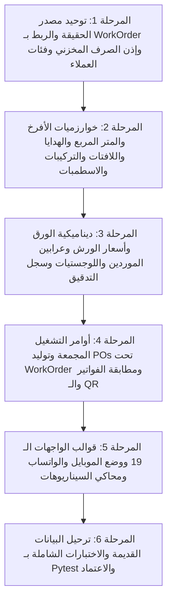

# الخطة التنفيذية الاحترافية الشاملة لشركات الدعاية والإعلان والوساطة الطباعية (Agency Master Plan 39.0)

## 📌 1. نموذج العمل والرؤية الشاملة (Agency Business Model)
تطوير منظومة تسعير المطبوعات والهدايا واللافتات (`printing_pricing`) في **MWHEBA ERP** لتلائم بدقة **شركات الدعاية والإعلان والوساطة الطباعية (Advertising Agencies & Print Brokers)** عبر معمارية متكاملة تربط 5 قطاعات تجارية مع موديولات النظام (أوامر الشغل، المبيعات، المشتريات، والمخازن):
* **مظلة أمر الشغل الموحدة (Work Order Job-Costing Hub):** ربط رأس أمر التسعير `PrintingOrder` بأمر الشغل `work_order.WorkOrder` كمركز تكلفة وربحية مصغر، وترحيل نفس رقم أمر الشغل تلقائياً إلى كافة أوامر الشراء `purchase.PurchaseOrder` الصادرة للورش والموردين، لتوحيد إيراد العميل ومصروفات الورش وحساب صافي ربح الشغلانة في شاشة واحدة 360 درجة.
* **المطبوعات الورقية والكرتون:** (أوفست، ديجيتال، علب، كتب، مجلات، فلايرات، فولدرات، ستيكرات) بتسعير الورق بالفرخ مع **«حساب الهالك التراكمي لكافة مراحل الورش»**، وتوليد **«إذن صرف مخزني آلي لأفرخ الورق (Paper Stock Issue Requisition)»** عند السحب من مخزن الوكالة، وإصدار **«أمر تشغيل مجمع للمطبعة (Consolidated Press Job Sheet)»** عند تعدد البنود.
* **المساحات العريضة والـ Outdoor:** (رول اب، بانر، فليكس، فينيل، ستيكر سيارات، UV، ستاندات وشاسيهات) بتسعير مباشر للمتر المربع ($M^2$).
* **اللافتات والتركيبات الميدانية (Signage & Site Installation):** (كلادينج، حروف بارزة LED، تجليد واجهات وزجاج، تجليد أساطيل سيارات، يوميات الفنيين، وتأجير السقالات والأوناش).
* **الهدايا الدعائية واليونيفورم والمعارض:** (مجات، أقلام، فلاشات، نوت بوك، تيشرتات يونيفورم، دروع تكريم، وتجهيزات بوثات المعارض).
* **خدمات التصميم الجرافيكي والإبداع:** (أتعاب التصميم الجديد، التعديل والمونتاج، وفصل الألوان).
* **اللوجستيات ومسؤولية النقل:** (حاسبة مشاوير النقل مع **«صمام الحد الأدنى لمصاريف التوصيل للطلبات الصغيرة Minimum Drop Fee»** وتحديد الطرف المتحمل: على حساب الوكالة / محمل على العميل / توصيل مجاني من المورد).
* **الإدارة المالية والسيولة والتسعير المتدرج:** (تسعير تلقائي حسب تصنيف العميل B2B/Corporate/Retail، تتبع دفعات وعرابين الورش وخصمها آلياً، وعمولات المناديب على صافي الربح، ووضع الموبايل والواتساب).

---

## 🎨 2. خريطة القوالب الشاملة 100% (Cross-Module Templates Matrix)

### أ) قوالب موديول التسعير الأساسي (`templates/printing_pricing/`):
1. **`templates/printing_pricing/orders/order_form.html`** *(تحديث جذري وتفكيك)*:
   * تفكيك القالب (1312 سطر) لمكونات فرعية `partials`، ودعم أزرار القوالب السريعة (Presets)، وحقول أتعاب التصميم، الهدايا، اللافتات، المتر المربع، والربط بـ `WorkOrder`.
2. **`templates/printing_pricing/orders/order_detail.html`** *(تحديث شامل)*:
   * عرض تفكيك التكلفة، أوامر الشراء الصادرة للورش، فواتير الموردين، سجل التدقيق، وأزرار طباعة أوامر التشغيل.
3. **`templates/printing_pricing/orders/order_list.html`** *(ترقية معيارية)*:
   * تطبيق معايير الـ ERP الموحدة: كروت الـ KPI الإحصائية، فلترة قابلة للطي، وجدول بيانات تفاعلي مع SSR Pagination.
4. **`templates/printing_pricing/dashboard.html`** *(ترقية لوحة BI)*:
   * مؤشرات تحويل عروض الأسعار، الخامات الأكثر طلباً، ومتوسط هوامش الأرباح المحققة.
5. **`templates/printing_pricing/orders/outsourced_job_sheet.html`** *(جديد)*:
   * أمر تشغيل رسمي نظيف ومجرد 100% من الأسعار للورش والمطابع الخارجية.
6. **`templates/printing_pricing/orders/consolidated_job_sheet.html`** *(جديد)*:
   * أمر التشغيل المجمع للمطبعة عند وجود عدة بنود لنفس العميل.
7. **`templates/printing_pricing/orders/mobile_pricing_mode.html`** *(جديد)*:
   * واجهة التسعير الميداني السريع للموبايل والمشاركة الفورية لعرض السعر PDF على الواتساب.
8. **`templates/printing_pricing/orders/partials/formula_inspector_modal.html`** *(جديد)*:
   * نافذة مفتش تفاصيل الحسبة والشفافية لمسؤول التسعير.
9. **`templates/printing_pricing/orders/partials/change_order_modal.html`** *(جديد)*:
   * نافذة ملحق التعديلات الطارئة وتوثيق الهادر المالي والفني.
10. **`templates/printing_pricing/orders/carton_labels.html`** *(جديد)*:
    * استيكرات ترقيم وتوصيف الكراتين قبل الشحن (كرتونة 1 من N).
11. **`templates/printing_pricing/orders/delivery_note.html`** *(جديد)*:
    * إذن تسليم بضاعة رسمي لتوقيع واستلام العميل.
12. **`templates/printing_pricing/orders/executive_summary.html`** *(جديد)*:
    * ملخص التفاوض التنفيذي السري للمناقصات والصفقات الكبرى.
13. **`templates/printing_pricing/orders/qc_signoff_modal.html`** *(جديد)*:
    * شيك ليست بوابة مراقبة الجودة الرقمية قبل التسليم.
14. **`templates/printing_pricing/orders/partial_delivery_schedule.html`** *(جديد)*:
    * جدول التوريد والتسليم المقسم على دفعات.

### ب) القوالب المترابطة في الموديولات الأخرى (Cross-Module Templates):
15. **`templates/work_order/work_order_detail.html`** *(تحديث)*:
    * عرض لوحة تحكم الأرباح الموحدة 360 درجة: (إيراد العميل + أمر التسعير + أوامر شراء الورش + فواتير الموردين والعرابين + صافي الربح الفعلي).
16. **`templates/sale/quotations/quotation_form.html`** *(تحديث)*:
    * إضافة نافذة وزر «استيراد بند مطبوع مسعر» مع تجميد السعر وشروط الدفعة المقدمة 50%.
17. **`templates/sale/orders/sale_order_form.html`** *(تحديث)*:
    * إتاحة استيراد بنود التسعير مباشرة في أمر البيع وتوليد أمر الشغل آلياً.
18. **`templates/purchase/orders/purchase_order_detail.html`** *(تحديث)*:
    * إظهار شارة ورابط أمر الشغل المرتبط `WorkOrder` وبيانات البند المطبوع الخاص بالورشة.
19. **`templates/product/stock_issue_form.html`** *(تحديث)*:
    * دعم صرف أفرخ الورق المربوطة برقم أمر الشغل والتسعير آلياً.

---

## 🎯 3. الركائز والمعايير المعتمدة لشركات الدعاية (Agency Master Principles)

1. **الربط بمظلة أمر الشغل الموحدة (Work Order Job-Costing Hub):**
   * ربط `PrintingOrder` بـ `work_order.WorkOrder` وترحيل رقم أمر الشغل آلياً لكل `purchase.PurchaseOrder` صادر للورش، لتجميع إيراد العميل وفواتير الورش وعرابينها في شاشة واحدة توضح صافي ربح الشغلانة الفعلي.
2. **المصطلحات القياسية المعتمدة:** استخدام مصطلح **«فرخ / أفرخ»** حصرياً ومنع أي لفظ آخر.
3. **تسعير الورق ديناميكي 100% بالفرخ:** (سحب مباشر من رصيد وتكلفة مخزن الوكالة، أو من قائمة أسعار تاجر الورق المختار) ومنع الإدخال اليدوي.
4. **توليد أوامر الشراء للورش تحت نفس أمر الشغل (1-Click Automated Vendor POs under WorkOrder):**
   * توليد أوامر شراء وخدمات آلية في موديول المشتريات (`purchase.PurchaseOrder`) لكل مورد وورشة بمبالغها ومواصفاتها وربطها بنفس `work_order` بمجرد اعتماد أمر البيع.
5. **إذن الصرف المخزني الآلي لأفرخ الورق (Paper Stock Issue Requisition):**
   * عند اختيار سحب الورق من مخزن الوكالة واعتماد الطلب، يولد السيستم آلياً إذن صرف مخزني يخصم إجمالي أفرخ الورق المطلوبة (شاملاً الهالك التراكمي) من كارت الصنف في موديول المخازن `product` برقم أمر الشغل.
6. **أمر التشغيل المجمع للمطبعة عند تعدد البنود (Consolidated Vendor Job Sheet):**
   * إتاحة طباعة مستند فني مجمع يضم كافة البنود والمقاسات المسندة لنفس المطبعة في ورقة واحدة منظمة ومجردة من الأسعار.
7. **حساب الهالك التراكمي لكافة مراحل الورش المتتالية (Cumulative Chain Waste):**
   * احتساب مجموع هوالك التشغيل لكل مرحلة (هالك سحب المطبعة + هالك السلوفان + هالك التكسير + هالك التجليد) وإضافتها على أفرخ الورق المشتراة لضمان تسليم الكمية الصافية للعميل 100% بدون نقص نسخة واحدة.
8. **معاملة تكاليف المطابع والورش بصافي المبالغ المباشرة (بدون ضريبة للمطابع):**
   * اعتماد أسعار الورش والمطابع كأسعار صافية ومباشرة بدون تعقيدات ضريبية على خدمات التشغيل.
9. **حاسبة النقل واللوجستيات مع تحديد الطرف المتحمل (Logistics & Freight Payer):**
   * احتساب تكلفة مشاوير النقل مع خيار تحديد المسؤولية: (نقل على حساب الوكالة / محمل ومفوتر على العميل / توصيل مجاني من التاجر).
10. **الحد الأدنى لمصاريف النقل والتداول للطلبات الصغيرة (Minimum Drop Fee):**
   * تطبيق حد أدنى ملزم لمصاريف مشاوير النقل والتداول في الأوردرات الخفيفة والصغيرة لمنع تآكل أرباح الوكالة في مصاريف المشاوير.
11. **التسعير الذكي حسب فئات العملاء (Client Category Pricing Tiers):**
   * تطبيق هوامش الربح الافتراضية تلقائياً حسب تصنيف العميل: (أفراد وشركات صغيرة Retail: 35-40% / حسابات كبرى Corporate: 20-25% / مكاتب دعاية ووسطاء B2B Trade: 10-15%).
12. **تتبع عرابين ودفعات الورش وخصمها آلياً (Vendor Downpayments Tracking):**
   * ربط سندات صرف الدفعات المقدمة للورش والمطابع بأمر الشغل وخصمها تلقائياً عند تسجيل الفاتورة النهائية للمورد لمنع السداد المكرر.
13. **احتساب عمولات المبيعات على صافي مجمل الربح (Commission on Net Margin):**
   * احتساب عمولة مسؤول المبيعات آلياً كنسبة من $(\text{سعر البيع} - \text{تكاليف الخامات والورش والنقل})$ لمنع حرق الأسعار وحماية أرباح الوكالة.
14. **وضع التسعير الميداني عبر الموبايل والمشاركة الفورية (Mobile Sales & WhatsApp Share):**
   * واجهة متجاوبة 100% مع الموبايل تسعر الأوردر في 30 ثانية وتتيح إرسال ملف PDF لعرض السعر المعتمد على واتساب العميل مباشرة أثناء الاجتماع.
15. **بند أعمال التركيبات الميدانية واللافتات (Site Installation & Signage):**
   * احتساب يوميات الفنيين، وأجرة المعاينة ورفع المقاسات، وتأجير السقالات والأوناش، وتجليد واجهات المحلات والسيارات وتضمينها في التكلفة الإجمالية.
16. **أتعاب التصميم الجرافيكي والتجهيز الفني (Creative Design Fees):**
   * خيارات محددة: تصميم جاهز من العميل (0 ج) / تعديل فني ومونتاج / تصميم إبداعي جديد بالكامل لحفظ حقوق الوكالة في أتعاب التصميم.
17. **محرك تسعير الهدايا الدعائية واليونيفورم وتجهيزات المعارض:**
   * تسعير المنتجات الخام (مجات، أقلام، نوت بوك، تيشرتات، دروع، خلفيات بوثات المعارض) + تكلفة طباعة الورشة (سيلك سكرين، DTF، تطريز، ليزر، UV مسطح) + هامش ربح الوكالة.
18. **مصفوفة أسعار التشغيل الخارجي للورش والمطابع (Outsourced Vendors Matrix):**
   * سحب المطابع (أوفست حتى أول 1000 فرخ كحد أدنى + سعر كل 1000 فرخ إضافي / طبع وقلب / وجهين).
   * محطات الزنكات CTP (ربط سعر الزنكة بمقاس سرير الماكينة: ربع / نصف / فرخ كامل).
   * ورش التشطيب: سلوفان (حراري / معالج للبصمة)، تكسير (اسطمبة جديدة لأول مرة مقابل اسطمبة سابقة محفوظة بالأرشيف)، بصمة، يوفي، تجليد.
19. **مطابقة فواتير الموردين وحساب صافي ربح الوكالة الحقيقي (Live SupplierBill Matching & Realized Profit):**
   * ربط ومطابقة فواتير الخدمات الفعلية من الموردين (`SupplierBill`) مع التكاليف التقديرية لإظهار صافي الربح الفعلي وفروق الأسعار (Variance) في شاشة التسعير وأمر الشغل.
20. **توحيد مصدر الحقيقة المالية (Single Canonical Truth):**
   * إنهاء ازدواجية الحقول وتضارب الأرقام عبر 4 جداول؛ اعتماد `PrintingOrder` كرأس مستند أساسي وتحديثه بالتزامن مع سطور المواد والخدمات عبر معاملة ذرية واحدة (`transaction.atomic`).
21. **استراتيجية الترحيل الآمن (Zero-Risk Migration Strategy):**
   * تحويل علاقات `PaperSpecification` و `PrintingSpecification` من `OneToOneField` إلى `ForeignKey` بميجريشن آمن `0003_upgrade_specs_to_multi_part.py` لدعم المنتجات المركبة وتعدد الأجزاء دون كسر السجلات التاريخية.
22. **عروض الأسعار الهجينة وجسر المبيعات:**
   * زر «إضافة بند مطبوع مسعر» داخل عروض الأسعار وأوامر البيع، يدعم دمج أصناف المخزن الجاهزة مع المطبوعات المخصصة وتجميد السعر وتوليد وصف تسويقي وتضمين شرط الدفعة المقدمة 50%.
23. **مفتش تفاصيل الحسبة والشفافية (Formula & Cost Inspector Modal):**
   * نافذة تفاعلية توضح لمسؤول التسعير بالمللي تفاصيل تجميع التكلفة: (تكلفة الورق + هالك الورش التراكمي + زنكات CTP + سحب المطبعة + خدمات الورش + التصميم + التركيبات + النقل + هامش الربح = سعر البيع).
24. **ذاكرة أسعار العميل (Customer Price Memory):**
   * إظهار آخر سعر وتاريخ تم البيع به لنفس العميل عند اختياره في الشاشة لضمان التفاوض الذكي.
25. **ملخص التفاوض التنفيذي للمناقصات الكبرى (Executive Negotiation Sheet PDF/Excel):**
   * تقرير سري لمديري الوكالة يوضح تفاصيل التكاليف والحد الأدنى للخصم دون خسارة.
26. **إعادة التسعير التلقائي للطلبات المكررة بأسعار اليوم (Live Auto-Reprice on Re-orders):**
   * عند تكرار طلب عميل قديم، يعيد السيستم حساب تكلفة الورق وسحب المطابع بأسعار اليوم الحية مع إظهار مقارنة السعر القديم والجديد.
27. **صمام انتهاء صلاحية عروض الأسعار (Quotation Expiry Guard):**
   * تحديد مدة صلاحية ملزمة لعرض السعر (3 إلى 7 أيام للورق) وتحويله تلقائياً إلى `EXPIRED` لمنع العميل من التنفيذ بأسعار قديمة بعد ارتفاع أسعار الورق بالسوق.
28. **مستشار زيادة المبيعات والكميات الاقتصادية الذكي (Smart Upselling Advisor):**
   * شريط تنبيه يوجه البائع أثناء مكالمة العميل لاقتراح زيادة الكمية لاستغلال فتحة ماكينة المطبعة وتخفيض سعر القطعة.
29. **محرك اقتراح الخامات البديلة المتاحة بالمخزن (Smart Stock Substitutes):**
   * اقتراح آلي لأقرب خامات ورقية متطابقة ومتاحة بمخزن الوكالة عند نقص خامة معينة مع إظهار فرق التكلفة.
30. **خيار الطباعة على خامات وورق العميل (Customer-Supplied Paper):**
   * تشغيل خامات العميل (تكلفة الورق = 0 ج) مع حساب الهالك واقتصار التكلفة على خدمات الورش والمطابع.
31. **ملحق التعديلات الطارئة بعد بدء التشغيل (Change Order Addendum):**
   * توثيق أي تعديل طارئ يطلبه العميل وحساب تكلفة الخامات المهدرة (الزنكات أو الورق) وتحميلها آلياً على فاتورة العميل.
32. **جدول التوريد والتسليم المقسم على دفعات (Partial Deliveries Schedule):**
   * دعم تقسيم تسليم الكميات الكبيرة على دفعات مع أذون تسليم واستيكرات كراتين مستقلة لكل دفعة.
33. **بوابة فحص مراقبة الجودة قبل التسليم (QC Sign-off Gateway):**
   * شيك ليست جودة رقمية عند استلام الشغل من المطابع وقبل تسليمه للعميل.
34. **استيكرات الكراتين وإذن التسليم (Carton Labels & Delivery Notes):**
   * استيكرات مرقمة (كرتونة 1 من N) وإذن تسليم بضاعة رسمي لتوقيع العميل.
35. **صمام تحوط تقلبات أسعار الورق المستورد (FX Volatility Buffer 2-5%):**
   * نسبة تحوط مرنة على خامات الورق لحماية أرباح الوكالة.
36. **الرمز الأمني المشفر لعروض الأسعار (Security Cryptographic QR Code):**
   * رمز QR مشفر على ملف PDF لعرض السعر يفتح صفحة تحقق رسمية تؤكد صحة السعر والمواصفات.
37. **فحص الحد الائتماني للعميل (Credit Limit Guard):**
   * فحص مديونية العميل واشتراط موافقة مالية في حال تجاوز السقف الائتماني.
38. **تسعير عينات الماكيت والبلوتر (Plotter Dummy Sample Cost):**
   * احتساب تكلفة العينات الهيكلية البيضاء لعلب التعبئة والتغليف.
39. **رصد فضلات الورق الصالحة ورصد أوزان الدشت بالكيلوجرام (Scrap & Offcut Tracking).**
40. **قوالب التسعير السريع بضغطة زر (1-Click Presets Toolbar):**
   * شريط أزرار للمنتجات الشائعة (كروت، فلايرات، بروشورات، فولدرات، رول اب، ستيكرات، مجات، أقلام، تيشرتات، يافطة كلادينج) لملء البيانات في ثانيتين.
41. **محاكي السيناريوهات الفوري لمكالمات المبيعات (Instant "What-If" Reactive Engine < 50ms).**
42. **الحفظ التلقائي المحلي ضد انقطاع النت (LocalStorage Draft Recovery).**
43. **تسعير المساحات العريضة بالمتر المربع المباشر ($M^2$).**
44. **الطباعة التجميعية (Gang Run / Combo Printing):**
   * تسعير الكروت والاستيكرات المجمعة لتقاسم تكلفة الزنكات والسحب ومضاعفة الأرباح.
45. **لوحة تحليلات مؤشرات الأداء الحية (Printing BI Dashboard):**
   * معدل تحويل عروض الأسعار، الخامات الأكثر طلباً، ومتوسط هوامش الأرباح المحققة.
46. **معمارية API-First والتخزين السحابي للمرفقات الثقيلة (Smart Artwork Storage).**
47. **التكامل مع `core.SystemModule` وتوحيد الحقول على `customer` و `final_price` وتغطية شاملة بـ `pytest`.**

---

## 🏗️ 4. المراحل التنفيذية لشركات الدعاية (Agency Action Plan)

---

### 📌 المرحلة 1: توحيد مصدر الحقيقة والربط بـ WorkOrder وإذن الصرف المخزني وفئات العملاء

* **الهدف:** ربط أمر التسعير بأمر الشغل `work_order.WorkOrder`، والقضاء على ازدواجية البيانات، وتطبيق ميجريشن آمن `0003_upgrade_specs_to_multi_part.py`، وإذن الصرف المخزني الآلي للورق، وحساب الهالك التراكمي للورش، والتسعير التلقائي حسب فئات العملاء، وأتعاب التصميم، وعمولات المبيعات على صافي الربح، وصمام صلاحية عروض الأسعار، ومستشار زيادة المبيعات، وبدائل المخزن، وفحص الائتمان، وتشغيل ورق العميل، وتوحيد الحقول.
* **الملفات المستهدفة:**
  * `printing_pricing/models/order.py`
  * `printing_pricing/models/materials.py`
  * `printing_pricing/models/services.py`
  * `printing_pricing/models/calculations.py`
  * `work_order/models.py`
  * `printing_pricing/services/calculators/base_calculator.py`
  * `printing_pricing/services/calculators/printing_calculator.py`
  * `printing_pricing/services/calculators/material_calculator.py`

#### المهام التنفيذية المباشرة:
1. **جراحة الموديلات وتحديث قاعدة البيانات بأمان والربط بـ WorkOrder:**
   * إضافة `work_order = models.ForeignKey("work_order.WorkOrder", on_delete=models.SET_NULL, null=True, blank=True, related_name="printing_orders")` في `PrintingOrder`.
   * تحويل `PaperSpecification` و `PrintingSpecification` إلى `ForeignKey(PrintingOrder)`.
   * إنشاء الميجريشن الآمن `0003_upgrade_specs_to_multi_part.py` وتشغيله للحفاظ على السجلات التاريخية.
2. **محرك حساب الهالك التراكمي وإذن الصرف المخزني الآلي:**
   * تجميع هوالك السحب، السلوفان، والتكسير وتوليد إذن صرف مخزني للورق المسحوب من المخزن برقم أمر الشغل.
3. **التسعير التلقائي حسب تصنيف العميل وأتعاب التصميم وعمولات المبيعات:**
   * قراءة تصنيف العميل وتطبيق هامش الربح الافتراضي، وإضافة حقول أتعاب التصميم وحساب عمولة المندوب على صافي الربح.
4. **توحيد مصدر الحقيقة المالية (Single Canonical Truth & Atomic Save):**
   * جعل `PrintingOrder` رأس المستند المالي وتحديثه مع سطور المواد والخدمات داخل `transaction.atomic` واحدة.
5. **تصحيح المحرك الحسابي والرياضي الصارم:**
   * تطبيق معادلة هامش الربح الحقيقي للوكالة: $\text{السعر} = \frac{\text{التكلفة}}{1 - (\text{الهامش} / 100)}$ وبرمجة الحساب العكسي والتقريب التجاري.
   * برمجة فتحة الماكينة للأوفست، وسحب الزنكات CTP بمقاس الماكينة، وتشغيل خامات العميل (تكلفة الورق = 0 ج).
6. **صمام انتهاء صلاحية عروض الأسعار ومستشار المبيعات وبدائل المخزن وفحص الائتمان والأداء (Zero N+1) وتوحيد الحقول.**

---

### 📌 المرحلة 2: خوارزميات الأفرخ والمتر المربع والهدايا واللافتات والتركيبات والاسطمبات

* **الهدف:** تطبيق معادلات المونتاج، ومحرك تسعير اللافتات والتركيبات الميدانية، والهدايا الدعائية واليونيفورم، وتجهيزات المعارض، والتمييز بين اسطمبات التكسير الجديدة والأرشيف، وتسعير المساحات العريضة المباشر ($M^2$)، والطلبات الشقيقة، وعينات الماكيت.
* **الملفات المستهدفة:**
  * `printing_pricing/services/calculators/material_calculator.py`
  * `printing_pricing/services/calculators/printing_calculator.py`
  * `printing_pricing/services/calculators/service_calculator.py`
  * `printing_pricing/models/settings_models.py`

#### المهام التنفيذية:
1. **محرك تسعير اللافتات والتركيبات الميدانية (Signage & Site Installation):**
   * احتساب أجرة المعاينة، ويوميات الفنيين، وإيجار السقالات والأوناش، وتجليد الواجهات والسيارات.
2. **محرك تسعير الهدايا الدعائية واليونيفورم وتجهيزات المعارض (Merchandising & Booths):**
   * تسعير المنتجات الخام + طباعة الورش (سيلك سكرين، DTF، تطريز، ليزر) + هامش الربح.
3. **التمييز بين اسطمبة التكسير الجديدة والأرشيف (Die Mould Tooling vs Archived):**
   * خيار لتفصيل اسطمبة جديدة أول مرة أو إلغاء تكلفتها (0 ج) عند استخدام اسطمبة سابقة محفوظة بالأرشيف.
4. **محرك تسعير المساحات العريضة المباشر بالمتر المربع ($M^2$ Engine):**
   * للرول اب والبانر والفليكس والفينيل والـ UV مع الشاسيهات والإكسسوارات.
5. **تسعير المقاسات المتعددة للحملة الواحدة، وعينات الماكيت والبلوتر، وفضلات الورق، والتعبئة والكراتين.**

---

### 📌 المرحلة 3: ديناميكية الورق وأسعار الورش وعرابين الموردين وصمام الحد الأدنى للنقل وسجل التدقيق

* **الهدف:** جلب أسعار الورق ديناميكياً، ومصفوفة أسعار المطابع والورش بأسعار صافية، وتتبع دفعات وعرابين الموردين، وحاسبة مشاوير النقل مع **«صمام الحد الأدنى لمصاريف النقل Minimum Drop Fee»**، وصمام تحوط العملة (FX Buffer)، وأداة التحديث المجمع لأسعار الموردين، وسجل التدقيق.
* **الملفات المستهدفة:**
  * `printing_pricing/models/materials.py`
  * `supplier/models.py`
  * `product/models.py`
  * `purchase/models/payment.py`
  * `printing_pricing/models/settings_models.py`

#### المهام التنفيذية:
1. **مصدر تسعير الورق المزدوج ومصفوفة الورش وتتبع العرابين:**
   * قراءة تكلفة الفرخ من المخزن أو المورد مع صمام تحوط العملة (FX Buffer 2-5%)، وربط الدفعات المقدمة للموردين بالأمر.
2. **حاسبة محطات النقل وصمام الحد الأدنى (Multi-Leg Freight & Minimum Drop Fee):**
   * احتساب تكلفة النقل مع ضمان تطبيق الحد الأدنى وتحديد الطرف المتحمل: (على حساب الوكالة / محمل على العميل / مجاني من التاجر).
3. **أداة التحديث المجمع لأسعار الموردين والورش (Bulk Price Updater):**
   * واجهة جدولية سريعة لتعديل أسعار أفرخ الورق وسحب المطابع وخدمات الورش في ثوانٍ.
4. **سجل تاريخ التعديلات المالية (Price Audit Trail) ورابط الاعتماد الرقمي للبروفة (Proof Sign-off).**

---

### 📌 المرحلة 4: أوامر التشغيل المجمعة وتوليد POs تحت WorkOrder ومطابقة الفواتير والـ QR

* **الهدف:** طباعة أمر التشغيل المجمع للمطبعة، وتوليد أوامر الشراء `PurchaseOrder` للورش آلياً وربطها بنفس `work_order`، ومطابقة فواتير الموردين `SupplierBill` مع خصم العرابين، وبوابة فحص الجودة، ولوحة مؤشرات الأداء BI، وملخص التفاوض التنفيذي، واستيكرات الكراتين، وإذن التسليم، والـ QR الأمني، وملحق التعديلات الطارئة.
* **الملفات المستهدفة:**
  * `printing_pricing/views/dashboard_views.py`
  * `printing_pricing/services/procurement_bridge.py`
  * `work_order/views.py`
  * `templates/printing_pricing/orders/outsourced_job_sheet.html`
  * `templates/printing_pricing/orders/consolidated_job_sheet.html`
  * `templates/printing_pricing/orders/carton_labels.html`
  * `templates/printing_pricing/orders/delivery_note.html`
  * `templates/printing_pricing/orders/qc_signoff_modal.html`
  * `templates/printing_pricing/orders/partial_delivery_schedule.html`
  * `templates/printing_pricing/orders/executive_summary.html`
  * `sale/models/quotation.py`
  * `purchase/models/procurement_models.py`

#### المهام التنفيذية:
1. **أمر التشغيل المجمع للمطبعة عند تعدد البنود (`Consolidated Press Job Sheet`):**
   * توليد مستند فني واحد يجمع كل بنود الأوردر المسندة لنفس المطبعة.
2. **خدمة توليد أوامر الشراء للورش تحت نفس أمر الشغل (`ProcurementBridgeService` with `WorkOrder`):**
   * توليد `PurchaseOrder` لكل ورشة ومورد في موديول المشتريات تلقائياً وترحيل `work_order` إليها.
3. **شاشة مطابقة فواتير الموردين وخصم العرابين المدفوعة (`SupplierBill Matching & Advances`):**
   * مطابقة فواتير الورش وخصم الدفعات المقدمة آلياً وحساب صافي الربح الفعلي المحقق في أمر الشغل.
4. **بوابة فحص مراقبة الجودة (QC Sign-off Gateway) واستلام الشغل من الورش.**
5. **جدول التوريد والتسليم المقسم، واستيكرات الكراتين، وإذن التسليم، والـ QR الأمني المشفر.**
6. **ملحق التعديلات الطارئة بعد بدء التشغيل (Change Order Addendum) ولوحة تحليلات BI Dashboard.**

---

### 📌 المرحلة 5: قوالب الواجهات الـ 19 ووضع الموبايل والواتساب ومحاكي السيناريوهات

* **الهدف:** بناء وتحديث كافة القوالب الـ 19، وبناء وضع التسعير السريع عبر الموبايل والمشاركة على الواتساب، وقوالب التسعير السريع بضغطة زر، ومحاكي السيناريوهات التفاعلي (<50ms)، وذاكرة أسعار العميل، ومفتش تفاصيل الحسبة (Formula Inspector)، والحفظ التلقائي في LocalStorage، وتفكيك القوالب.
* **الملفات المستهدفة:**
  * `templates/printing_pricing/orders/order_form.html`
  * `templates/printing_pricing/orders/order_detail.html`
  * `templates/printing_pricing/orders/order_list.html`
  * `templates/printing_pricing/orders/mobile_pricing_mode.html`
  * `templates/work_order/work_order_detail.html`
  * `templates/sale/quotations/quotation_form.html`
  * `templates/sale/orders/sale_order_form.html`
  * `templates/purchase/orders/purchase_order_detail.html`
  * `templates/product/stock_issue_form.html`
  * `templates/printing_pricing/orders/partials/`
  * `static/js/printing_pricing/field-handlers.js`

#### المهام التنفيذية:
1. **تحديث وتكامل قوالب النظام الـ 19:**
   * ربط شاشات `WorkOrder` و `Quotation` و `PurchaseOrder` و `StockIssue` مع شاشات التسعير.
2. **وضع التسعير الميداني للموبايل ومشاركة الواتساب (Mobile Pricing & WhatsApp Share):**
   * واجهة كروت سريعة للموبايل والتابلت تتيح إرسال عرض السعر مباشرة للعميل على الواتساب.
3. **مفتش تفاصيل الحسبة والشفافية (Formula Inspector Modal):**
   * نافذة تفاعلية توضح بالمللي تفاصيل تجميع التكلفة والأرباح.
4. **قوالب التسعير السريع بضغطة زر (1-Click Presets Toolbar):**
   * شريط أزرار (كارت، فلاير، بروشور، فولدر، رول اب، ستيكر، مج، قلم، تيشرت، يافطة) يملأ البيانات في ثانيتين.
5. **ذاكرة أسعار العميل ومحاكي السيناريوهات اللحظي (<50ms) والحفظ التلقائي المحلي.**
6. **تفكيك القالب الرئيسي (1312 سطر) لمكونات سريعة والالتزام بألوان مسطحة من `:root` بدون تدرجات.**

---

### 📌 المرحلة 6: ترحيل البيانات القديمة والاختبارات الشاملة بـ Pytest والاعتماد

* **الأداة:** `pytest` وفقاً لقواعد المشروع.
* **ملفات الاختبار والترحيل:**
  * `printing_pricing/migrations/0003_upgrade_specs_to_multi_part.py`
  * `tests/printing_pricing/test_agency_canonical_truth.py`
  * `tests/printing_pricing/test_work_order_integration.py`
  * `tests/printing_pricing/test_all_19_templates_rendering.py` (اختبار تكامل كافة القوالب الـ 19)
  * `tests/printing_pricing/test_stock_issue_and_consolidated_job.py`
  * `tests/printing_pricing/test_cumulative_stage_waste.py`
  * `tests/printing_pricing/test_client_tiers_and_advances.py`
  * `tests/printing_pricing/test_design_fees_and_merchandise.py`
  * `tests/printing_pricing/test_signage_and_installation.py`
  * `tests/printing_pricing/test_commissions_and_mobile_sales.py`
  * `tests/printing_pricing/test_automated_po_generation.py`
  * `tests/printing_pricing/test_outsourced_vendor_matrix.py`
  * `tests/printing_pricing/test_multi_leg_logistics.py`
  * `tests/printing_pricing/test_expiry_upselling_and_substitutes.py`
  * `tests/printing_pricing/test_qc_gateway_and_job_sheets.py`
  * `tests/printing_pricing/test_partial_deliveries_schedule.py`
  * `tests/printing_pricing/test_change_order_addendum.py`
  * `tests/printing_pricing/test_customer_supplied_stock.py`
  * `tests/printing_pricing/test_die_tooling_and_plates.py`
  * `tests/printing_pricing/test_bi_dashboard_metrics.py`
  * `tests/printing_pricing/test_reorder_auto_repricing.py`
  * `tests/printing_pricing/test_sibling_multi_sizing.py`
  * `tests/printing_pricing/test_security_qr_and_verification.py`
  * `tests/printing_pricing/test_data_migration_safety.py`
  * `tests/sale/test_quotation_printing_import.py`

#### سيناريوهات التحقق:
* ✅ اختبار أمان الترحيل وعدم فقدان أي طلب قديم في قاعدة البيانات.
* ✅ اختبار استجابة ورندرة كافة القوالب الـ 19 المترابطة بدون أي خطأ.
* ✅ اختبار ربط أمر التسعير وأوامر الشراء التابعة له بنفس أمر الشغل `WorkOrder`.
* ✅ اختبار تطبيق الحد الأدنى لمصاريف النقل والتداول للطلبات الصغيرة.
* ✅ اختبار توليد إذن الصرف المخزني للورق وأمر التشغيل المجمع للمطبعة.
* ✅ اختبار دقة حساب الهالك التراكمي لمراحل الورش وضمان عدم نقص الكمية الصافية المسلمة للعميل.
* ✅ اختبار التسعير التلقائي حسب فئات العملاء وتتبع وخصم دفعات وعرابين الورش.
* ✅ اختبار احتساب عمولات المناديب على صافي مجمل الربح ووضع الموبايل والمشاركة على الواتساب.
* ✅ اختبار تسعير اللافتات والتركيبات الميدانية والهدايا وتجهيزات المعارض وأتعاب التصميم.
* ✅ اختبار توليد أوامر الشراء والخدمات `PurchaseOrder` للورش آلياً بضغطة زر.
* ✅ اختبار مطابقة فواتير الموردين `SupplierBill` مع تكاليف التسعير وحساب صافي ربح الوكالة بالقرش.
* ✅ اختبار دقة حسابات النقل واللوجستيات وتحديد الطرف المتحمل.
* ✅ اختبار صمام صلاحية عروض الأسعار ومستشار المبيعات وبدائل المخزن.
* ✅ اختبار بوابة الجودة وإذن التسليم واستيكرات الكراتين والـ QR الأمني المشفر.

---

## ⏱️ الجدول الزمني لتنفيذ منظومة الوكالات الشاملة

| المرحلة | المهام التنفيذية التفصيلية | المدة المقدرة |
| :--- | :--- | :---: |
| **المرحلة 1** | توحيد مصدر الحقيقة، الربط بـ WorkOrder، الميجريشن الآمن، إذن الصرف المخزني، الهالك، فئات العملاء | **2 يوم** |
| **المرحلة 2** | خوارزميات الأفرخ، المتر المربع ($M^2$)، اللافتات والتركيبات، الهدايا، الاسطمبات، الماكيت | **2 يوم** |
| **المرحلة 3** | ديناميكية الورق، أسعار الورش، تتبع عرابين الموردين، حاسبة النقل وصمام الحد الأدنى، تحوط العملة | **2 يوم** |
| **المرحلة 4** | أمر التشغيل المجمع، توليد POs تحت WorkOrder، مطابقة فواتير الموردين وخصم العرابين، بوابة الجودة | **2 يوم** |
| **المرحلة 5** | قوالب الواجهات الـ 19، وضع الموبايل والواتساب، قوالب التسعير، مفتش الحسبة، محاكي السيناريوهات | **1.5 يوم** |
| **المرحلة 6** | سكربت الترحيل الآمن للبيانات، كتابة اختبارات Pytest الشاملة والاعتماد | **1.5 يوم** |
| **الإجمالي** | **تنفيذ المنظومة الشاملة لشركات الدعاية والإعلان والوساطة بالكامل** | **11 يوم عمل** |
